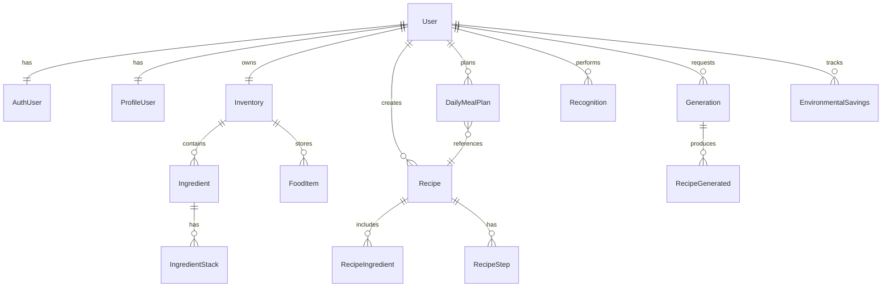

# ZeroWasteAI Backend API - Complete Documentation

## Table of Contents
1. [Project Overview](#project-overview)
2. [Architecture](#architecture)
3. [Getting Started](#getting-started)
4. [Authentication System](#authentication-system)
5. [API Endpoints](#api-endpoints)
6. [Data Models](#data-models)
7. [Database Schema](#database-schema)
8. [Security Features](#security-features)
9. [Flutter Integration Guide](#flutter-integration-guide)
10. [Error Handling](#error-handling)
11. [Examples](#examples)

## Project Overview

**ZeroWasteAI** is a comprehensive REST API designed to reduce food waste through AI-powered food recognition, intelligent inventory management, and personalized recipe generation. The system leverages modern technologies to provide a complete food management solution.

### Key Features
- 🔥 **Firebase Authentication + JWT Security**
- 🤖 **AI Food & Ingredient Recognition**
- 📦 **Smart Inventory Management**
- 🍳 **AI Recipe Generation**
- 📱 **Meal Planning System**
- 🌱 **Environmental Impact Tracking**
- 📸 **Image Management & Generation**
- 🛡️ **Enterprise Security Features**

### Technology Stack
- **Framework**: Flask 3.1.0 with Clean Architecture
- **Database**: MySQL with SQLAlchemy ORM
- **Authentication**: Firebase Admin + JWT Extended
- **AI Services**: Google Gemini AI
- **Storage**: Firebase Storage
- **Security**: Rate limiting, token blacklisting, security headers
- **Documentation**: Swagger/OpenAPI

### Base URL
- **Development**: `http://localhost:3000`
- **Production**: `https://your-domain.com`

## Architecture

The project follows **Clean Architecture** principles with the following layers:

```
src/
├── domain/                 # Business logic and entities
│   ├── models/            # Domain models
│   ├── repositories/      # Repository interfaces
│   └── services/          # Domain services
├── application/           # Use cases and application logic
│   ├── use_cases/        # Business use cases
│   ├── services/         # Application services
│   └── factories/        # Dependency injection
├── infrastructure/       # External services and data access
│   ├── db/               # Database implementation
│   ├── auth/             # Authentication services
│   ├── firebase/         # Firebase integration
│   ├── ai/               # AI services
│   └── security/         # Security implementations
├── interface/            # Controllers and serializers
│   ├── controllers/      # API controllers
│   ├── serializers/      # Request/response serializers
│   └── middlewares/      # Middleware functions
└── shared/               # Shared utilities
    ├── dtos/             # Data transfer objects
    ├── exceptions/       # Custom exceptions
    └── decorators/       # Utility decorators
```

## Getting Started

### Prerequisites
- Python 3.8+
- MySQL 8.0+
- Firebase Project with Authentication and Storage
- Google AI API Key (Gemini)

### Installation

1. **Clone the repository**
```bash
git clone <repository-url>
cd Backend-Rest-API
```

2. **Create virtual environment**
```bash
python -m venv venv
source venv/bin/activate  # On Windows: venv\Scripts\activate
```

3. **Install dependencies**
```bash
pip install -r requirements.txt
```

4. **Environment Configuration**
Create `.env` file:
```env
# Database Configuration
DB_HOST=localhost
DB_PORT=3306
DB_NAME=zerowaste_db
DB_USER=your_db_user
DB_PASSWORD=your_db_password

# JWT Configuration
JWT_SECRET_KEY=your-super-secret-jwt-key

# Firebase Configuration
FIREBASE_CREDENTIALS_PATH=src/config/firebase_credentials.json

# Google AI Configuration
GOOGLE_API_KEY=your-gemini-api-key

# Security Configuration
FLASK_ENV=development
SECRET_KEY=your-flask-secret-key
```

5. **Database Setup**
```bash
# The application will automatically create tables on startup
python src/main.py
```

6. **Access Documentation**
- API Documentation: `http://localhost:3000/apidocs`
- Health Check: `http://localhost:3000/status`

## Authentication System

### Overview
The system uses a dual-token approach combining Firebase Authentication for user verification with JWT tokens for API access.

### Authentication Flow

1. **Firebase Authentication**: Client authenticates with Firebase
2. **Token Exchange**: Firebase ID token exchanged for JWT tokens
3. **API Access**: JWT tokens used for all API calls
4. **Token Refresh**: Secure token rotation with reuse detection

### Security Features

- **Token Blacklisting**: Revoked tokens are tracked
- **Token Rotation**: Refresh tokens implement secure rotation
- **Reuse Detection**: Automatic session invalidation on token reuse
- **Rate Limiting**: Configurable limits per endpoint
- **Security Logging**: Comprehensive audit trails
- **IP Tracking**: Monitor for suspicious activity

### Firebase Setup Required

1. Create Firebase project
2. Enable Authentication (Google, Facebook, Email, etc.)
3. Enable Firestore Database
4. Enable Firebase Storage
5. Download service account credentials
6. Place credentials in `src/config/firebase_credentials.json`

## API Endpoints

### Authentication Endpoints (`/api/auth`)

#### POST `/api/auth/firebase-signin`
**Description**: Main authentication endpoint - exchange Firebase ID token for JWT tokens

**Headers**:
```
Authorization: Bearer <firebase_id_token>
Content-Type: application/json
```

**Response**:
```json
{
  "access_token": "eyJ0eXAiOiJKV1QiLCJhbGciOiJIUzI1NiJ9...",
  "refresh_token": "eyJ0eXAiOiJKV1QiLCJhbGciOiJIUzI1NiJ9...",
  "expires_in": 1800,
  "user": {
    "uid": "firebase_user_uid",
    "email": "user@example.com",
    "name": "User Name"
  }
}
```

#### POST `/api/auth/refresh`
**Description**: Refresh access token using refresh token

**Headers**:
```
Authorization: Bearer <refresh_token>
Content-Type: application/json
```

**Response**:
```json
{
  "access_token": "new_access_token",
  "expires_in": 1800
}
```

#### POST `/api/auth/logout`
**Description**: Secure logout - invalidates all user tokens

**Headers**:
```
Authorization: Bearer <access_token>
```

**Response**:
```json
{
  "message": "Successfully logged out"
}
```

#### GET `/api/auth/firebase-debug`
**Description**: Debug Firebase configuration (development only)

**Note**: This endpoint should be disabled in production. Used for debugging Firebase connectivity issues.

**Response**:
```json
{
  "firebase_apps": 1,
  "credentials_path": "/path/to/firebase-credentials.json",
  "storage_bucket": "zerowasteai-12345.appspot.com",
  "credentials_exists": true,
  "project_id": "zerowasteai-12345",
  "client_email": "firebase-adminsdk-abc123@zerowasteai-12345.iam.gserviceaccount.com"
}
```

### User Management (`/api/user`)

#### GET `/api/user/profile`
**Description**: Get user profile from Firestore

**Headers**:
```
Authorization: Bearer <access_token>
```

**Response**:
```json
{
  "uid": "firebase_user_uid",
  "displayName": "User Name",
  "email": "user@example.com",
  "photoURL": "https://profile-image-url",
  "language": "es",
  "cookingLevel": "beginner",
  "measurementUnit": "metric",
  "allergies": ["lactose", "gluten"],
  "preferredFoodTypes": ["vegetarian"],
  "favoriteRecipes": [],
  "initialPreferencesCompleted": true
}
```

#### PUT `/api/user/profile`
**Description**: Update user profile

**Headers**:
```
Authorization: Bearer <access_token>
Content-Type: application/json
```

**Request Body**:
```json
{
  "displayName": "Updated Name",
  "language": "en",
  "cookingLevel": "intermediate",
  "allergies": ["nuts"],
  "preferredFoodTypes": ["vegetarian", "mediterranean"]
}
```

### Food Recognition (`/api/recognition`)

#### POST `/api/recognition/ingredients`
**Description**: AI recognition of ingredients from images

**Headers**:
```
Authorization: Bearer <access_token>
Content-Type: application/json
```

**Request Body**:
```json
{
  "images_paths": [
    "uploads/user_uid/ingredients/image1.jpg",
    "uploads/user_uid/ingredients/image2.jpg"
  ]
}
```

**Response**:
```json
{
  "recognition_id": "recognition_uuid",
  "ingredients": [
    {
      "name": "tomate",
      "confidence": 0.95,
      "quantity": 3,
      "unit": "unidades",
      "storage_type": "refrigerador",
      "expiration_days": 7,
      "has_allergen_risk": false,
      "image_path": "generated/ingredients/tomate.jpg"
    }
  ],
  "total_recognized": 2,
  "processing_time": 1.5
}
```

#### POST `/api/recognition/foods`
**Description**: AI recognition of prepared foods

**Headers**:
```
Authorization: Bearer <access_token>
Content-Type: application/json
```

**Request Body**:
```json
{
  "images_paths": ["uploads/user_uid/foods/dish.jpg"]
}
```

**Response**:
```json
{
  "recognition_id": "recognition_uuid",
  "foods": [
    {
      "name": "arroz_chaufa",
      "confidence": 0.88,
      "category": "almuerzo",
      "main_ingredients": ["arroz", "pollo", "huevo"],
      "estimated_calories": 450,
      "serving_quantity": 1,
      "storage_type": "refrigerador",
      "expiration_time": 3,
      "time_unit": "Días"
    }
  ]
}
```

### Inventory Management (`/api/inventory`)

#### GET `/api/inventory`
**Description**: Get complete user inventory

**Headers**:
```
Authorization: Bearer <access_token>
```

**Response**:
```json
{
  "ingredients": [
    {
      "name": "tomate",
      "stacks": [
        {
          "quantity": 5.0,
          "unit": "unidades",
          "added_at": "2024-01-15T10:30:00Z",
          "expiration_date": "2024-01-22T10:30:00Z",
          "days_until_expiration": 7,
          "status": "fresh"
        }
      ],
      "total_quantity": 5.0,
      "storage_type": "refrigerador",
      "image_path": "ingredients/tomate.jpg"
    }
  ],
  "foods": [
    {
      "name": "arroz_chaufa",
      "quantity": 2,
      "added_at": "2024-01-15T12:00:00Z",
      "expiration_date": "2024-01-18T12:00:00Z",
      "category": "almuerzo",
      "calories": 450,
      "serving_quantity": 1
    }
  ],
  "summary": {
    "total_ingredients": 15,
    "total_foods": 3,
    "expiring_soon": 2
  }
}
```

#### POST `/api/inventory/ingredients`
**Description**: Add ingredients to inventory

**Headers**:
```
Authorization: Bearer <access_token>
Content-Type: application/json
```

**Request Body**:
```json
{
  "ingredients": [
    {
      "name": "tomate",
      "quantity": 5,
      "unit": "unidades",
      "storage_type": "refrigerador",
      "expiration_date": "2024-01-22T10:30:00Z"
    }
  ]
}
```

#### POST `/api/inventory/ingredients/from-recognition`
**Description**: Add ingredients from AI recognition results

**Request Body**:
```json
{
  "recognition_id": "recognition_uuid",
  "selected_ingredients": [
    {
      "name": "tomate",
      "quantity": 3,
      "unit": "unidades"
    }
  ]
}
```

#### GET `/api/inventory/expiring`
**Description**: Get items expiring soon

**Query Parameters**:
- `days` (optional): Days threshold (default: 3)

**Response**:
```json
{
  "expiring_ingredients": [
    {
      "name": "leche",
      "quantity": 1,
      "unit": "litros",
      "expiration_date": "2024-01-17T10:00:00Z",
      "days_until_expiration": 2
    }
  ],
  "expiring_foods": [],
  "total_expiring": 1
}
```

### Recipe Management (`/api/recipes`)

#### POST `/api/recipes/generate-from-inventory`
**Description**: Generate recipes using available inventory

**Headers**:
```
Authorization: Bearer <access_token>
Content-Type: application/json
```

**Request Body**:
```json
{
  "preferences": {
    "meal_type": "almuerzo",
    "difficulty": "Fácil",
    "max_cooking_time": 30,
    "dietary_restrictions": ["vegetarian"]
  },
  "exclude_ingredients": ["cebolla"]
}
```

**Response**:
```json
{
  "generation_id": "generation_uuid",
  "recipes": [
    {
      "uid": "recipe_uuid",
      "title": "Ensalada de Tomate y Albahaca",
      "description": "Ensalada fresca y saludable",
      "duration": "15 minutos",
      "difficulty": "Fácil",
      "category": "ensalada",
      "servings": 2,
      "ingredients": [
        {
          "name": "tomate",
          "quantity": 3,
          "unit": "unidades"
        },
        {
          "name": "albahaca",
          "quantity": 10,
          "unit": "hojas"
        }
      ],
      "steps": [
        {
          "order": 1,
          "description": "Lavar y cortar los tomates en rodajas"
        },
        {
          "order": 2,
          "description": "Agregar hojas de albahaca fresca"
        }
      ],
      "nutritional_info": {
        "calories": 85,
        "protein": 2.1,
        "carbs": 8.7,
        "fat": 0.5
      },
      "image_status": "generating"
    }
  ],
  "using_ingredients": ["tomate", "albahaca"],
  "total_recipes": 3
}
```

#### POST `/api/recipes/save`
**Description**: Save a recipe to user favorites

**Request Body**:
```json
{
  "recipe_uid": "recipe_uuid"
}
```

#### GET `/api/recipes/saved`
**Description**: Get user's saved recipes

**Response**:
```json
{
  "recipes": [
    {
      "uid": "recipe_uuid",
      "title": "Recipe Title",
      "category": "almuerzo",
      "saved_at": "2024-01-15T10:30:00Z",
      "image_path": "recipes/recipe_uuid.jpg"
    }
  ],
  "total": 5
}
```

#### GET `/api/recipes/all`
**Description**: Get all recipes in the system (public and community recipes)

**Response**:
```json
{
  "recipes": [
    {
      "recipe_uid": "system_recipe_001",
      "name": "Pasta Carbonara Clásica",
      "description": "La auténtica receta italiana de carbonara",
      "cuisine_type": "italiana",
      "difficulty": "intermedio",
      "prep_time": 25,
      "servings": 4,
      "source": "community"
    }
  ],
  "count": 10
}
```

#### GET `/api/recipes/default`
**Description**: Get default system recipes (no authentication required)

**Query Parameters**:
- `category` (optional): Filter by category (destacadas, rapidas_faciles, vegetarianas, postres, saludables)

**Response**:
```json
{
  "default_recipes": [
    {
      "uid": "default_recipe_001",
      "title": "Pasta Carbonara Clásica",
      "duration": "30 minutos",
      "difficulty": "Intermedio",
      "category": "almuerzo",
      "description": "La auténtica receta italiana de carbonara",
      "ingredients": [...],
      "steps": [...]
    }
  ],
  "total_recipes": 14
}
```

#### DELETE `/api/recipes/delete`
**Description**: Delete a saved recipe from user's collection

**Request Body**:
```json
{
  "title": "Recipe title to delete"
}
```

### Meal Planning (`/api/planning`)

#### POST `/api/planning/save`
**Description**: Save meal plan for specific date

**Request Body**:
```json
{
  "date": "2024-01-20",
  "meals": {
    "breakfast": [
      {
        "recipe_uid": "recipe_uuid_1",
        "servings": 2
      }
    ],
    "lunch": [
      {
        "recipe_uid": "recipe_uuid_2",
        "servings": 4
      }
    ],
    "dinner": [],
    "snacks": []
  }
}
```

#### GET `/api/planning/get`
**Description**: Get meal plan for specific date

**Query Parameters**:
- `date` (required): Date in YYYY-MM-DD format

**Response**:
```json
{
  "date": "2024-01-20",
  "meals": {
    "breakfast": [
      {
        "recipe": {
          "uid": "recipe_uuid",
          "title": "Pancakes",
          "image_path": "recipes/pancakes.jpg"
        },
        "servings": 2
      }
    ],
    "lunch": [],
    "dinner": [],
    "snacks": []
  },
  "total_planned_meals": 1
}
```

#### GET `/api/planning/dates`
**Description**: Get all dates with meal plans

**Response**:
```json
{
  "dates": [
    "2024-01-15",
    "2024-01-16",
    "2024-01-20"
  ],
  "total_dates": 3
}
```

### Recipe Generation (`/api/recipes`)

#### POST `/api/recipes/generate-custom`
**Description**: Generate custom recipe with specific ingredients

**Request Body**:
```json
{
  "ingredients": [
    {
      "name": "Pollo",
      "quantity": 500,
      "unit": "gr"
    }
  ],
  "cuisine_type": "italiana",
  "difficulty": "intermedio",
  "prep_time": "medio",
  "dietary_restrictions": [],
  "meal_type": "almuerzo",
  "servings": 4
}
```

**Response**:
```json
{
  "generated_recipes": [
    {
      "name": "Pasta al Pollo con Tomates Frescos",
      "description": "Una deliciosa pasta italiana...",
      "ingredients": [...],
      "steps": [...],
      "prep_time": 45,
      "servings": 4,
      "difficulty": "intermedio"
    }
  ],
  "generation_id": "gen_123xyz",
  "images": {
    "status": "generating",
    "task_id": "task_abc123"
  }
}
```

### Environmental Impact (`/api/environmental-savings`)

#### POST `/api/environmental-savings/calculate/from-title`
**Description**: Calculate environmental impact by recipe title

**Request Body**:
```json
{
  "recipe_title": "Ensalada de Tomate",
  "servings": 2
}
```

**Response**:
```json
{
  "calculation_id": "calculation_uuid",
  "recipe_title": "Ensalada de Tomate",
  "environmental_impact": {
    "carbon_footprint": 0.5,
    "water_footprint": 15.2,
    "energy_footprint": 2.1,
    "economic_cost": 3.50,
    "sustainability_score": 8.5
  },
  "units": {
    "carbon": "kg CO2e",
    "water": "litros",
    "energy": "MJ",
    "cost": "USD"
  },
  "is_cooked": false
}
```

#### GET `/api/environmental-savings/summary`
**Description**: Get consolidated environmental summary

**Response**:
```json
{
  "total_calculations": 15,
  "total_impact": {
    "carbon_saved": 12.5,
    "water_saved": 150.0,
    "energy_saved": 45.2,
    "money_saved": 75.00
  },
  "average_sustainability_score": 7.8,
  "recipes_cooked": 8,
  "recipes_planned": 7
}
```

## Data Models

### Core Entities

#### User Model
```python
class User:
    uid: str                    # Primary key (Firebase UID)
    email: Optional[str]        # Email (nullable for anonymous)
    created_at: datetime
    updated_at: datetime
```

#### Inventory System
```python
class Inventory:
    user_uid: str              # One-to-one with User
    
class Ingredient:
    name: str                  # Ingredient name
    inventory_user_uid: str    # Foreign key
    type_unit: str            # Unit of measurement
    storage_type: str         # Storage requirements
    tips: Optional[str]       # Usage tips
    image_path: str

class IngredientStack:
    ingredient_name: str       # Composite primary key
    inventory_user_uid: str    # Composite primary key  
    added_at: datetime         # Composite primary key
    quantity: float
    expiration_date: datetime

class FoodItem:
    id: int                   # Auto-increment primary key
    inventory_user_uid: str   # Foreign key
    name: str
    main_ingredients: List[str]  # JSON array
    category: str
    calories: Optional[float]
    description: str
    storage_type: str
    expiration_time: int
    time_unit: str
    serving_quantity: int
    image_path: str
    added_at: datetime
    expiration_date: datetime
```

#### Recipe System
```python
class Recipe:
    uid: str                  # Primary key
    user_uid: str            # Foreign key to User
    title: str
    duration: str
    difficulty: str          # "Fácil", "Intermedio", "Difícil"
    category: str            # "desayuno", "almuerzo", "cena", etc.
    description: str
    footer: Optional[str]
    generated_by_ai: bool
    saved_at: datetime
    image_path: Optional[str]
    image_status: str        # "generating", "completed", "failed"

class RecipeIngredient:
    id: int                  # Auto-increment
    recipe_uid: str         # Foreign key
    name: str
    quantity: int
    type_unit: str

class RecipeStep:
    id: int                 # Auto-increment  
    recipe_uid: str        # Foreign key
    step_order: int
    description: str
```

### Validation Rules

#### Ingredient Units
Valid units: `["gramos", "kg", "litros", "ml", "unidades", "cucharadas", "tazas", "hojas", "dientes", "pizca"]`

#### Storage Types  
Valid types: `["refrigerador", "congelador", "despensa", "temperatura_ambiente"]`

#### Recipe Categories
Valid categories: `["desayuno", "almuerzo", "cena", "postre", "ensalada", "sopa", "bebida"]`

#### Recipe Difficulties
Valid difficulties: `["Fácil", "Intermedio", "Difícil"]`

## Database Schema

### Relationships Overview



### Key Tables

#### Security Tables
- `token_blacklist`: Revoked token tracking
- `refresh_token_tracking`: Refresh token security with reuse detection

#### Cascade Relationships
- User deletion cascades to all related data
- Inventory deletion cascades to ingredients and food items
- Recipe deletion cascades to ingredients and steps

## Security Features

### Authentication Security
- **Firebase + JWT Dual Layer**: Firebase for user verification, JWT for API access
- **Token Rotation**: Refresh tokens implement secure rotation
- **Reuse Detection**: Automatic session invalidation on token reuse
- **Token Blacklisting**: Comprehensive revoked token tracking

### API Security
- **Rate Limiting**: Configurable limits per endpoint type
- **Security Headers**: CSRF, XSS, clickjacking protection
- **HTTPS Enforcement**: Strict Transport Security headers
- **IP Tracking**: Monitor suspicious activity patterns

### Data Security
- **Input Validation**: Comprehensive validation on all inputs
- **SQL Injection Protection**: Parameterized queries via SQLAlchemy
- **File Upload Security**: Type validation and size limits
- **Content Security Policy**: Prevents XSS attacks

## Flutter Integration Guide

### 1. Setup Dependencies

Add to `pubspec.yaml`:
```yaml
dependencies:
  firebase_core: ^2.24.2
  firebase_auth: ^4.15.3
  google_sign_in: ^6.1.5
  http: ^1.1.0
  shared_preferences: ^2.2.2
  dio: ^5.3.2  # Alternative HTTP client with interceptors
```

### 2. Firebase Configuration

Initialize Firebase in `main.dart`:
```dart
import 'package:firebase_core/firebase_core.dart';

void main() async {
  WidgetsFlutterBinding.ensureInitialized();
  await Firebase.initializeApp();
  runApp(MyApp());
}
```

### 3. Authentication Service

Create `auth_service.dart`:
```dart
import 'package:firebase_auth/firebase_auth.dart';
import 'package:google_sign_in/google_sign_in.dart';
import 'package:http/http.dart' as http;
import 'dart:convert';

class AuthService {
  static const String baseUrl = 'http://your-api-url.com';
  
  // Firebase Authentication
  static Future<UserCredential?> signInWithGoogle() async {
    try {
      final GoogleSignInAccount? googleUser = await GoogleSignIn().signIn();
      if (googleUser == null) return null;

      final GoogleSignInAuthentication googleAuth = 
          await googleUser.authentication;
      
      final credential = GoogleAuthProvider.credential(
        accessToken: googleAuth.accessToken,
        idToken: googleAuth.idToken,
      );
      
      return await FirebaseAuth.instance.signInWithCredential(credential);
    } catch (e) {
      print('Google Sign In Error: $e');
      return null;
    }
  }

  // Exchange Firebase token for JWT
  static Future<Map<String, dynamic>?> exchangeFirebaseToken() async {
    try {
      final User? user = FirebaseAuth.instance.currentUser;
      if (user == null) return null;

      final String? idToken = await user.getIdToken();
      if (idToken == null) return null;

      final response = await http.post(
        Uri.parse('$baseUrl/api/auth/firebase-signin'),
        headers: {
          'Authorization': 'Bearer $idToken',
          'Content-Type': 'application/json',
        },
      );

      if (response.statusCode == 200) {
        return json.decode(response.body);
      }
      return null;
    } catch (e) {
      print('Token exchange error: $e');
      return null;
    }
  }

  // Refresh JWT token
  static Future<String?> refreshToken(String refreshToken) async {
    try {
      final response = await http.post(
        Uri.parse('$baseUrl/api/auth/refresh'),
        headers: {
          'Authorization': 'Bearer $refreshToken',
          'Content-Type': 'application/json',
        },
      );

      if (response.statusCode == 200) {
        final data = json.decode(response.body);
        return data['access_token'];
      }
      return null;
    } catch (e) {
      print('Token refresh error: $e');
      return null;
    }
  }

  // Logout
  static Future<void> logout() async {
    try {
      final accessToken = await TokenManager.getAccessToken();
      if (accessToken != null) {
        await http.post(
          Uri.parse('$baseUrl/api/auth/logout'),
          headers: {
            'Authorization': 'Bearer $accessToken',
            'Content-Type': 'application/json',
          },
        );
      }
      
      await GoogleSignIn().signOut();
      await FirebaseAuth.instance.signOut();
      await TokenManager.clearTokens();
    } catch (e) {
      print('Logout error: $e');
    }
  }
}
```

### 4. Token Management

Create `token_manager.dart`:
```dart
import 'package:shared_preferences/shared_preferences.dart';
import 'dart:convert';

class TokenManager {
  static const String _accessTokenKey = 'access_token';
  static const String _refreshTokenKey = 'refresh_token';
  static const String _tokenExpiryKey = 'token_expiry';

  static Future<void> saveTokens(String accessToken, String refreshToken, int expiresIn) async {
    final prefs = await SharedPreferences.getInstance();
    final expiryTime = DateTime.now().add(Duration(seconds: expiresIn));
    
    await prefs.setString(_accessTokenKey, accessToken);
    await prefs.setString(_refreshTokenKey, refreshToken);
    await prefs.setString(_tokenExpiryKey, expiryTime.toIso8601String());
  }

  static Future<String?> getAccessToken() async {
    final prefs = await SharedPreferences.getInstance();
    return prefs.getString(_accessTokenKey);
  }

  static Future<String?> getRefreshToken() async {
    final prefs = await SharedPreferences.getInstance();
    return prefs.getString(_refreshTokenKey);
  }

  static Future<bool> isTokenExpired() async {
    final prefs = await SharedPreferences.getInstance();
    final expiryString = prefs.getString(_tokenExpiryKey);
    
    if (expiryString == null) return true;
    
    final expiryTime = DateTime.parse(expiryString);
    return DateTime.now().isAfter(expiryTime.subtract(Duration(minutes: 5))); // 5 min buffer
  }

  static Future<String?> getValidAccessToken() async {
    if (await isTokenExpired()) {
      final refreshToken = await getRefreshToken();
      if (refreshToken != null) {
        final newAccessToken = await AuthService.refreshToken(refreshToken);
        if (newAccessToken != null) {
          final prefs = await SharedPreferences.getInstance();
          await prefs.setString(_accessTokenKey, newAccessToken);
          final newExpiry = DateTime.now().add(Duration(minutes: 30));
          await prefs.setString(_tokenExpiryKey, newExpiry.toIso8601String());
          return newAccessToken;
        }
      }
      return null; // Need to re-authenticate
    }
    return await getAccessToken();
  }

  static Future<void> clearTokens() async {
    final prefs = await SharedPreferences.getInstance();
    await prefs.remove(_accessTokenKey);
    await prefs.remove(_refreshTokenKey);
    await prefs.remove(_tokenExpiryKey);
  }
}
```

### 5. API Service with Automatic Token Management

Create `api_service.dart`:
```dart
import 'package:dio/dio.dart';
import 'token_manager.dart';
import 'auth_service.dart';

class ApiService {
  static const String baseUrl = 'http://your-api-url.com';
  late Dio _dio;

  ApiService() {
    _dio = Dio(BaseOptions(
      baseUrl: baseUrl,
      connectTimeout: Duration(seconds: 5),
      receiveTimeout: Duration(seconds: 3),
    ));

    // Add interceptor for automatic token handling
    _dio.interceptors.add(
      InterceptorsWrapper(
        onRequest: (options, handler) async {
          final token = await TokenManager.getValidAccessToken();
          if (token != null) {
            options.headers['Authorization'] = 'Bearer $token';
          }
          handler.next(options);
        },
        onError: (error, handler) async {
          if (error.response?.statusCode == 401) {
            // Token expired or invalid - try to refresh
            final refreshToken = await TokenManager.getRefreshToken();
            if (refreshToken != null) {
              final newToken = await AuthService.refreshToken(refreshToken);
              if (newToken != null) {
                // Retry the original request with new token
                error.requestOptions.headers['Authorization'] = 'Bearer $newToken';
                final cloneReq = await _dio.request(
                  error.requestOptions.path,
                  options: Options(
                    method: error.requestOptions.method,
                    headers: error.requestOptions.headers,
                  ),
                  data: error.requestOptions.data,
                  queryParameters: error.requestOptions.queryParameters,
                );
                return handler.resolve(cloneReq);
              }
            }
            // Refresh failed - redirect to login
            await AuthService.logout();
            // Navigate to login screen
          }
          handler.next(error);
        },
      ),
    );
  }

  // User Profile
  Future<Map<String, dynamic>?> getUserProfile() async {
    try {
      final response = await _dio.get('/api/user/profile');
      return response.data;
    } catch (e) {
      print('Get profile error: $e');
      return null;
    }
  }

  Future<bool> updateUserProfile(Map<String, dynamic> profileData) async {
    try {
      await _dio.put('/api/user/profile', data: profileData);
      return true;
    } catch (e) {
      print('Update profile error: $e');
      return false;
    }
  }

  // Inventory
  Future<Map<String, dynamic>?> getInventory() async {
    try {
      final response = await _dio.get('/api/inventory');
      return response.data;
    } catch (e) {
      print('Get inventory error: $e');
      return null;
    }
  }

  Future<bool> addIngredientsToInventory(List<Map<String, dynamic>> ingredients) async {
    try {
      await _dio.post('/api/inventory/ingredients', data: {'ingredients': ingredients});
      return true;
    } catch (e) {
      print('Add ingredients error: $e');
      return false;
    }
  }

  // Food Recognition
  Future<Map<String, dynamic>?> recognizeIngredients(List<String> imagePaths) async {
    try {
      final response = await _dio.post(
        '/api/recognition/ingredients',
        data: {'images_paths': imagePaths},
      );
      return response.data;
    } catch (e) {
      print('Recognition error: $e');
      return null;
    }
  }

  // Recipe Generation
  Future<Map<String, dynamic>?> generateRecipesFromInventory({
    Map<String, dynamic>? preferences,
    List<String>? excludeIngredients,
  }) async {
    try {
      final response = await _dio.post(
        '/api/recipes/generate-from-inventory',
        data: {
          if (preferences != null) 'preferences': preferences,
          if (excludeIngredients != null) 'exclude_ingredients': excludeIngredients,
        },
      );
      return response.data;
    } catch (e) {
      print('Recipe generation error: $e');
      return null;
    }
  }

  // Meal Planning
  Future<bool> saveMealPlan(String date, Map<String, List<Map<String, dynamic>>> meals) async {
    try {
      await _dio.post('/api/planning/save', data: {
        'date': date,
        'meals': meals,
      });
      return true;
    } catch (e) {
      print('Save meal plan error: $e');
      return false;
    }
  }

  Future<Map<String, dynamic>?> getMealPlan(String date) async {
    try {
      final response = await _dio.get('/api/planning/get', queryParameters: {'date': date});
      return response.data;
    } catch (e) {
      print('Get meal plan error: $e');
      return null;
    }
  }
}
```

### 6. Models

Create data models for type safety:

```dart
// models/user_profile.dart
class UserProfile {
  final String uid;
  final String displayName;
  final String email;
  final String? photoURL;
  final String language;
  final String cookingLevel;
  final String measurementUnit;
  final List<String> allergies;
  final List<String> preferredFoodTypes;

  UserProfile({
    required this.uid,
    required this.displayName,
    required this.email,
    this.photoURL,
    required this.language,
    required this.cookingLevel,
    required this.measurementUnit,
    required this.allergies,
    required this.preferredFoodTypes,
  });

  factory UserProfile.fromJson(Map<String, dynamic> json) {
    return UserProfile(
      uid: json['uid'],
      displayName: json['displayName'] ?? '',
      email: json['email'] ?? '',
      photoURL: json['photoURL'],
      language: json['language'] ?? 'es',
      cookingLevel: json['cookingLevel'] ?? 'beginner',
      measurementUnit: json['measurementUnit'] ?? 'metric',
      allergies: List<String>.from(json['allergies'] ?? []),
      preferredFoodTypes: List<String>.from(json['preferredFoodTypes'] ?? []),
    );
  }

  Map<String, dynamic> toJson() {
    return {
      'uid': uid,
      'displayName': displayName,
      'email': email,
      'photoURL': photoURL,
      'language': language,
      'cookingLevel': cookingLevel,
      'measurementUnit': measurementUnit,
      'allergies': allergies,
      'preferredFoodTypes': preferredFoodTypes,
    };
  }
}

// models/ingredient.dart
class Ingredient {
  final String name;
  final List<IngredientStack> stacks;
  final double totalQuantity;
  final String storageType;
  final String imagePath;

  Ingredient({
    required this.name,
    required this.stacks,
    required this.totalQuantity,
    required this.storageType,
    required this.imagePath,
  });

  factory Ingredient.fromJson(Map<String, dynamic> json) {
    return Ingredient(
      name: json['name'],
      stacks: (json['stacks'] as List)
          .map((stack) => IngredientStack.fromJson(stack))
          .toList(),
      totalQuantity: json['total_quantity'].toDouble(),
      storageType: json['storage_type'],
      imagePath: json['image_path'],
    );
  }
}

class IngredientStack {
  final double quantity;
  final String unit;
  final DateTime addedAt;
  final DateTime expirationDate;
  final int daysUntilExpiration;
  final String status;

  IngredientStack({
    required this.quantity,
    required this.unit,
    required this.addedAt,
    required this.expirationDate,
    required this.daysUntilExpiration,
    required this.status,
  });

  factory IngredientStack.fromJson(Map<String, dynamic> json) {
    return IngredientStack(
      quantity: json['quantity'].toDouble(),
      unit: json['unit'],
      addedAt: DateTime.parse(json['added_at']),
      expirationDate: DateTime.parse(json['expiration_date']),
      daysUntilExpiration: json['days_until_expiration'],
      status: json['status'],
    );
  }
}

// models/recipe.dart
class Recipe {
  final String uid;
  final String title;
  final String description;
  final String duration;
  final String difficulty;
  final String category;
  final int servings;
  final List<RecipeIngredient> ingredients;
  final List<RecipeStep> steps;
  final String? imagePath;
  final String imageStatus;

  Recipe({
    required this.uid,
    required this.title,
    required this.description,
    required this.duration,
    required this.difficulty,
    required this.category,
    required this.servings,
    required this.ingredients,
    required this.steps,
    this.imagePath,
    required this.imageStatus,
  });

  factory Recipe.fromJson(Map<String, dynamic> json) {
    return Recipe(
      uid: json['uid'],
      title: json['title'],
      description: json['description'],
      duration: json['duration'],
      difficulty: json['difficulty'],
      category: json['category'],
      servings: json['servings'] ?? 1,
      ingredients: (json['ingredients'] as List)
          .map((ing) => RecipeIngredient.fromJson(ing))
          .toList(),
      steps: (json['steps'] as List)
          .map((step) => RecipeStep.fromJson(step))
          .toList(),
      imagePath: json['image_path'],
      imageStatus: json['image_status'] ?? 'generating',
    );
  }
}

class RecipeIngredient {
  final String name;
  final int quantity;
  final String unit;

  RecipeIngredient({
    required this.name,
    required this.quantity,
    required this.unit,
  });

  factory RecipeIngredient.fromJson(Map<String, dynamic> json) {
    return RecipeIngredient(
      name: json['name'],
      quantity: json['quantity'],
      unit: json['unit'],
    );
  }
}

class RecipeStep {
  final int order;
  final String description;

  RecipeStep({
    required this.order,
    required this.description,
  });

  factory RecipeStep.fromJson(Map<String, dynamic> json) {
    return RecipeStep(
      order: json['order'],
      description: json['description'],
    );
  }
}
```

### 7. Complete Authentication Flow Example

```dart
// screens/login_screen.dart
class LoginScreen extends StatefulWidget {
  @override
  _LoginScreenState createState() => _LoginScreenState();
}

class _LoginScreenState extends State<LoginScreen> {
  bool _isLoading = false;

  Future<void> _signInWithGoogle() async {
    setState(() => _isLoading = true);

    try {
      // Step 1: Firebase Authentication
      final userCredential = await AuthService.signInWithGoogle();
      if (userCredential == null) {
        _showError('Failed to sign in with Google');
        return;
      }

      // Step 2: Exchange Firebase token for JWT
      final tokenData = await AuthService.exchangeFirebaseToken();
      if (tokenData == null) {
        _showError('Failed to authenticate with server');
        return;
      }

      // Step 3: Save tokens
      await TokenManager.saveTokens(
        tokenData['access_token'],
        tokenData['refresh_token'],
        tokenData['expires_in'],
      );

      // Step 4: Navigate to main app
      Navigator.pushReplacementNamed(context, '/home');

    } catch (e) {
      _showError('Authentication failed: $e');
    } finally {
      setState(() => _isLoading = false);
    }
  }

  void _showError(String message) {
    ScaffoldMessenger.of(context).showSnackBar(
      SnackBar(content: Text(message)),
    );
  }

  @override
  Widget build(BuildContext context) {
    return Scaffold(
      body: Center(
        child: _isLoading
            ? CircularProgressIndicator()
            : ElevatedButton.icon(
                onPressed: _signInWithGoogle,
                icon: Icon(Icons.login),
                label: Text('Sign in with Google'),
              ),
      ),
    );
  }
}
```

### 8. Using the API Service

```dart
// Example usage in a widget
class InventoryScreen extends StatefulWidget {
  @override
  _InventoryScreenState createState() => _InventoryScreenState();
}

class _InventoryScreenState extends State<InventoryScreen> {
  final ApiService _apiService = ApiService();
  List<Ingredient> _ingredients = [];
  bool _isLoading = true;

  @override
  void initState() {
    super.initState();
    _loadInventory();
  }

  Future<void> _loadInventory() async {
    try {
      final inventoryData = await _apiService.getInventory();
      if (inventoryData != null) {
        setState(() {
          _ingredients = (inventoryData['ingredients'] as List)
              .map((ing) => Ingredient.fromJson(ing))
              .toList();
        });
      }
    } catch (e) {
      print('Error loading inventory: $e');
    } finally {
      setState(() => _isLoading = false);
    }
  }

  @override
  Widget build(BuildContext context) {
    return Scaffold(
      appBar: AppBar(title: Text('My Inventory')),
      body: _isLoading
          ? Center(child: CircularProgressIndicator())
          : ListView.builder(
              itemCount: _ingredients.length,
              itemBuilder: (context, index) {
                final ingredient = _ingredients[index];
                return ListTile(
                  leading: Image.network(
                    '${ApiService.baseUrl}/${ingredient.imagePath}',
                    width: 50,
                    height: 50,
                    fit: BoxFit.cover,
                  ),
                  title: Text(ingredient.name),
                  subtitle: Text('${ingredient.totalQuantity} ${ingredient.stacks.first.unit}'),
                  trailing: Text('${ingredient.stacks.first.daysUntilExpiration} days'),
                );
              },
            ),
      floatingActionButton: FloatingActionButton(
        onPressed: () {
          // Navigate to add ingredient screen
        },
        child: Icon(Icons.add),
      ),
    );
  }
}
```

## Error Handling

### HTTP Status Codes

| Code | Description | Action Required |
|------|-------------|-----------------|
| 200 | Success | Continue normally |
| 400 | Bad Request | Check request data |
| 401 | Unauthorized | Refresh token or re-authenticate |
| 403 | Forbidden | User lacks permissions |
| 404 | Not Found | Resource doesn't exist |
| 429 | Rate Limited | Wait and retry |
| 500 | Server Error | Retry later or report issue |

### Common Error Responses

```json
{
  "error": "Error description",
  "details": "Detailed error information",
  "code": "ERROR_CODE"
}
```

### Error Handling in Flutter

```dart
class ApiException implements Exception {
  final String message;
  final int? statusCode;
  final String? errorCode;

  ApiException(this.message, {this.statusCode, this.errorCode});

  @override
  String toString() => 'ApiException: $message';
}

// In your API service:
Future<Map<String, dynamic>?> makeRequest(String endpoint) async {
  try {
    final response = await _dio.get(endpoint);
    return response.data;
  } on DioException catch (e) {
    if (e.response != null) {
      final errorData = e.response!.data;
      throw ApiException(
        errorData['error'] ?? 'Unknown error',
        statusCode: e.response!.statusCode,
        errorCode: errorData['code'],
      );
    } else {
      throw ApiException('Network error: ${e.message}');
    }
  }
}
```

## Examples

### Complete Recipe Generation Flow

```dart
class RecipeGenerationExample {
  final ApiService _apiService = ApiService();

  Future<void> generateRecipesExample() async {
    try {
      // 1. Get user inventory
      final inventory = await _apiService.getInventory();
      print('Available ingredients: ${inventory?['ingredients']?.length}');

      // 2. Set preferences
      final preferences = {
        'meal_type': 'almuerzo',
        'difficulty': 'Fácil',
        'max_cooking_time': 30,
        'dietary_restrictions': ['vegetarian'],
      };

      // 3. Generate recipes
      final recipeData = await _apiService.generateRecipesFromInventory(
        preferences: preferences,
        excludeIngredients: ['cebolla'],
      );

      if (recipeData != null) {
        final recipes = (recipeData['recipes'] as List)
            .map((r) => Recipe.fromJson(r))
            .toList();

        print('Generated ${recipes.length} recipes');
        
        // 4. Save favorite recipe
        if (recipes.isNotEmpty) {
          final success = await _apiService.saveRecipe(recipes.first.uid);
          if (success) {
            print('Recipe saved to favorites');
          }
        }

        // 5. Add to meal plan
        final today = DateTime.now().toIso8601String().substring(0, 10);
        final mealPlan = {
          'lunch': [
            {
              'recipe_uid': recipes.first.uid,
              'servings': 2,
            }
          ],
          'breakfast': <Map<String, dynamic>>[],
          'dinner': <Map<String, dynamic>>[],
          'snacks': <Map<String, dynamic>>[],
        };

        await _apiService.saveMealPlan(today, mealPlan);
        print('Added to meal plan');
      }
    } catch (e) {
      print('Recipe generation failed: $e');
    }
  }
}
```

### Image Recognition and Inventory Management

```dart
class ImageRecognitionExample {
  final ApiService _apiService = ApiService();

  Future<void> recognizeAndAddToInventory() async {
    try {
      // 1. Upload images (implement file upload separately)
      final imagePaths = [
        'uploads/user_uid/ingredients/photo1.jpg',
        'uploads/user_uid/ingredients/photo2.jpg',
      ];

      // 2. Recognize ingredients
      final recognitionResult = await _apiService.recognizeIngredients(imagePaths);
      
      if (recognitionResult != null) {
        print('Recognition ID: ${recognitionResult['recognition_id']}');
        
        final recognizedIngredients = recognitionResult['ingredients'] as List;
        print('Recognized ${recognizedIngredients.length} ingredients');

        // 3. Review and select ingredients to add
        final selectedIngredients = recognizedIngredients
            .where((ing) => ing['confidence'] > 0.8) // Only high confidence
            .map((ing) => {
                  'name': ing['name'],
                  'quantity': ing['quantity'],
                  'unit': ing['unit'],
                  'storage_type': ing['storage_type'],
                  'expiration_date': DateTime.now()
                      .add(Duration(days: ing['expiration_days']))
                      .toIso8601String(),
                })
            .toList();

        // 4. Add to inventory
        if (selectedIngredients.isNotEmpty) {
          final success = await _apiService.addIngredientsToInventory(selectedIngredients);
          if (success) {
            print('Added ${selectedIngredients.length} ingredients to inventory');
          }
        }

        // 5. Check for allergens (if any were detected)
        final allergenItems = recognizedIngredients
            .where((ing) => ing['has_allergen_risk'] == true)
            .toList();
        
        if (allergenItems.isNotEmpty) {
          print('Warning: Allergen risk detected in ${allergenItems.length} items');
        }
      }
    } catch (e) {
      print('Recognition failed: $e');
    }
  }
}
```

This comprehensive documentation provides everything needed to understand and integrate with the ZeroWasteAI Backend API from a Flutter frontend perspective. The API offers robust features for food management, AI recognition, recipe generation, and meal planning, all secured with enterprise-level authentication and security features.

# Sistema de Planificación de Comidas

## 1. Descripción General
El sistema de planificación de comidas permite a los usuarios organizar sus comidas diarias, vinculándolas con recetas y gestionando su inventario de ingredientes. El sistema está diseñado para ser flexible y fácil de usar, permitiendo una planificación detallada de las comidas diarias.

## 2. Endpoints Disponibles

### 2.1 Guardar Plan de Comidas
**Endpoint:** `POST /api/planning/save`  
**Autenticación requerida:** Sí (JWT)

#### Descripción
Permite crear un nuevo plan de comidas para una fecha específica.

#### Request Body
```json
{
  "date": "2024-01-20",
  "meals": {
    "breakfast": {
      "name": "Avena con frutas",
      "description": "Desayuno nutritivo con avena y frutas frescas",
      "recipe_id": "recipe_123",
      "ingredients": ["Avena", "Plátano", "Miel", "Leche"],
      "prep_time_minutes": 10
    },
    "lunch": { },
    "dinner": { },
    "snacks": [ ]
  }
}
```

#### Respuesta Exitosa (201)
```json
{
  "message": "Plan de comidas guardado exitosamente",
  "meal_plan": {
    "id": "plan_abc123",
    "user_uid": "firebase_uid_123",
    "date": "2024-01-20",
    "meals": { },
    "created_at": "2024-01-15T10:00:00Z"
  }
}
```

### 2.2 Actualizar Plan de Comidas
**Endpoint:** `PUT /api/planning/update`  
**Autenticación requerida:** Sí (JWT)

#### Descripción
Permite modificar un plan de comidas existente.

#### Request Body
```json
{
  "meal_date": "2024-01-20",
  "breakfast": [
    {
      "recipe_uid": "recipe_pancakes_123",
      "servings": 2
    }
  ],
  "lunch": [ ],
  "dinner": [ ],
  "snacks": [ ]
}
```

#### Respuesta Exitosa (200)
```json
{
  "message": "Plan de comidas actualizado exitosamente",
  "meal_plan": {
    "meal_date": "2024-01-20",
    "user_uid": "firebase_uid_123",
    "meals": { },
    "daily_summary": {
      "total_recipes": 4,
      "total_servings": 10,
      "estimated_total_prep_time": 105,
      "total_daily_calories": 3060
    }
  }
}
```

### 2.3 Eliminar Plan de Comidas
**Endpoint:** `DELETE /api/planning/delete`  
**Autenticación requerida:** Sí (JWT)

#### Descripción
Elimina completamente un plan de comidas para una fecha específica.

#### Query Parameters
- `date`: Fecha del plan a eliminar (YYYY-MM-DD)

#### Respuesta Exitosa (200)
```json
{
  "message": "Plan de comidas del 2024-01-20 eliminado exitosamente.",
  "deleted_plan": {
    "meal_date": "2024-01-20",
    "user_uid": "firebase_uid_123",
    "deleted_at": "2024-01-16T16:45:00Z",
    "meals_removed": {
      "breakfast": 1,
      "lunch": 2,
      "dinner": 1,
      "snacks": 0,
      "total_recipes": 4
    }
  }
}
```

### 2.4 Obtener Plan de Comidas por Fecha
**Endpoint:** `GET /api/planning/get`  
**Autenticación requerida:** Sí (JWT)

#### Descripción
Obtiene los detalles completos de un plan de comidas para una fecha específica.

#### Query Parameters
- `date`: Fecha del plan (YYYY-MM-DD)

#### Respuesta Exitosa (200)
```json
{
  "meal_plan": {
    "meal_date": "2024-01-20",
    "user_uid": "firebase_uid_123",
    "created_at": "2024-01-15T14:30:00Z",
    "last_updated": "2024-01-16T09:15:00Z",
    "meals": { },
    "daily_summary": {
      "total_recipes": 3,
      "total_servings": 8,
      "estimated_total_prep_time": 75,
      "total_daily_calories": 2880
    },
    "inventory_analysis": {
      "total_ingredients_needed": 12,
      "available_in_inventory": 9,
      "missing_ingredients": 3,
      "shopping_list": [ ]
    }
  }
}
```

### 2.5 Obtener Todos los Planes de Comidas
**Endpoint:** `GET /api/planning/all`  
**Autenticación requerida:** Sí (JWT)

#### Descripción
Obtiene todos los planes de comidas del usuario con estadísticas y resumen.

#### Respuesta Exitosa (200)
```json
{
  "meal_plans": [
    {
      "meal_date": "2024-01-20",
      "status": "upcoming",
      "meals": { },
      "daily_summary": { }
    }
  ],
  "summary": {
    "total_plans": 15,
    "date_range": {
      "earliest": "2024-01-01",
      "latest": "2024-01-25"
    },
    "statistics": { }
  }
}
```

### 2.6 Obtener Fechas con Planes
**Endpoint:** `GET /api/planning/dates`  
**Autenticación requerida:** Sí (JWT)

#### Descripción
Obtiene una lista de fechas que tienen planes de comidas asociados.

#### Respuesta Exitosa (200)
```json
{
  "meal_plan_dates": [
    {
      "date": "2024-01-20",
      "status": "upcoming",
      "total_recipes": 3,
      "meal_types": ["breakfast", "lunch", "dinner"],
      "created_at": "2024-01-18T10:00:00Z"
    }
  ],
  "summary": {
    "total_dates_with_plans": 4,
    "planning_streak": { },
    "averages": { }
  }
}
```

## 3. Características Principales

### 3.1 Gestión de Comidas
- Soporte para múltiples tipos de comidas (desayuno, almuerzo, cena, snacks)
- Vinculación con recetas existentes
- Control de porciones por comida
- Tiempo de preparación estimado

### 3.2 Análisis Nutricional
- Cálculo de calorías totales por día
- Distribución de macronutrientes
- Balance nutricional por comida
- Recomendaciones de ajuste

### 3.3 Integración con Inventario
- Verificación de ingredientes disponibles
- Lista de compras automática
- Tracking de ingredientes faltantes
- Optimización de uso de inventario

### 3.4 Estadísticas y Análisis
- Resumen diario de planes
- Tendencias de planificación
- Consistencia en la planificación
- Variedad de recetas utilizadas

## 4. Seguridad
- Autenticación mediante JWT
- Validación de propiedad de planes
- Protección contra modificaciones no autorizadas
- Registro de cambios y auditoría

## 5. Manejo de Errores
- Validación de formatos de fecha
- Verificación de existencia de planes
- Control de acceso y permisos
- Respuestas de error detalladas

## 6. Recomendaciones de Uso
1. Planificar comidas con anticipación
2. Verificar inventario antes de crear planes
3. Mantener balance nutricional entre comidas
4. Utilizar la función de análisis para optimizar planes
5. Revisar regularmente las estadísticas para mejorar la planificación