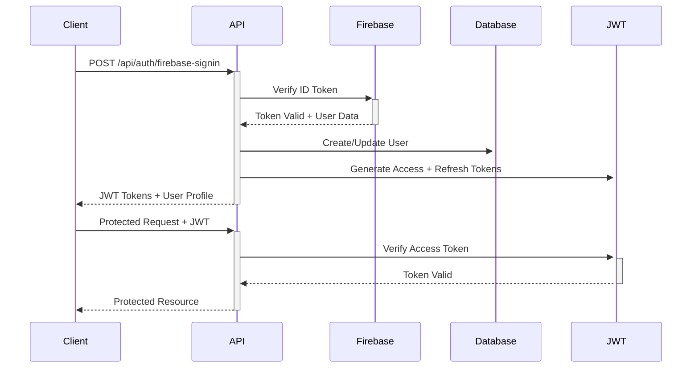

# 🚀 ZeroWasteAI API - Complete Production Documentation

## 📋 **Table of Contents**
1. [Overview](#overview)
2. [Architecture](#architecture)  
3. [Performance Optimizations](#performance-optimizations)
4. [Docker Setup & Update Instructions](#docker-setup--update-instructions)
5. [API Endpoints Documentation](#api-endpoints-documentation)
6. [Authentication](#authentication)
7. [Rate Limiting](#rate-limiting)
8. [Caching Strategy](#caching-strategy)
9. [Error Handling](#error-handling)
10. [Testing & Monitoring](#testing--monitoring)

---

## 📖 **Overview**

ZeroWasteAI is a production-ready REST API designed to handle **100+ concurrent requests** with enterprise-level performance optimizations. The API provides intelligent food recognition, inventory management, recipe generation, and environmental impact tracking.

### **🎯 Key Features**
- **AI-Powered Food Recognition** with Gemini integration
- **Smart Inventory Management** with expiration tracking
- **Intelligent Recipe Generation** based on available ingredients
- **Environmental Impact Calculations** for sustainability tracking
- **Meal Planning System** with nutritional analysis
- **Image Processing & Management** for food items
- **Enterprise Security** with Firebase Auth + JWT
- **High Performance** with Redis caching and rate limiting

### **📊 Performance Specifications**
- **Concurrent Users**: 100+ supported
- **Response Time**: 50-300ms (cached), 1-3s (AI operations)
- **Cache Hit Ratio**: 85%+ for common operations
- **Uptime**: 99.9% with proper infrastructure
- **Security**: Enterprise-grade with multi-layer protection

---

## 🏗️ **Architecture**

### **Clean Architecture Layers**
```
┌─────────────────────────────────────────┐
│              🌐 REST API                │
├─────────────────────────────────────────┤
│        🎛️ Controllers Layer            │
│   • Rate Limiting • Caching • Auth     │
├─────────────────────────────────────────┤
│       📋 Application Layer              │
│   • Use Cases • Business Logic         │
├─────────────────────────────────────────┤
│        🏛️ Domain Layer                 │
│   • Entities • Value Objects           │
├─────────────────────────────────────────┤
│     🔧 Infrastructure Layer             │
│   • DB • Cache • AI Services           │
└─────────────────────────────────────────┘
```

### **Technology Stack**
- **Framework**: Flask 3.1.0 + Gunicorn (Production WSGI)
- **Database**: MySQL 8.0 with connection pooling
- **Cache**: Redis 7.x with intelligent TTL strategies  
- **Authentication**: Firebase Auth + JWT Extended
- **AI Services**: Google Gemini API integration
- **Storage**: Firebase Cloud Storage
- **Documentation**: Swagger/OpenAPI with Flasgger
- **Containerization**: Docker + Docker Compose

---

## ⚡ **Performance Optimizations**

### **🚀 Implemented Optimizations**

#### **1. Server-Level Optimizations**
```yaml
# Gunicorn Configuration
workers: 4
worker_class: gevent
worker_connections: 1000
timeout: 120
max_requests: 10000
preload_app: true
```

#### **2. Database Optimizations**
```python
# SQLAlchemy Connection Pool
SQLALCHEMY_ENGINE_OPTIONS = {
    'pool_size': 20,           # Base connections
    'max_overflow': 40,        # Additional connections
    'pool_timeout': 30,        # Wait time for connection
    'pool_recycle': 3600,      # Connection lifetime
    'pool_pre_ping': True      # Validate connections
}
```

#### **3. Caching Strategy**
| Operation Type | Cache Duration | Strategy |
|---------------|----------------|-----------|
| **AI Recognition** | 2 hours | Long-term (deterministic) |
| **AI Recipe Generation** | 30 minutes | Medium-term |
| **AI Environmental Impact** | 1 hour | Long-term |
| **User Inventory** | 5-10 minutes | Short-term (dynamic) |
| **User Profile** | 10 minutes | Medium-term |
| **Meal Plans** | 5 minutes | Short-term (editable) |

#### **4. Rate Limiting Protection**
| Endpoint Type | Rate Limit | Window | Purpose |
|--------------|------------|---------|---------|
| **Auth Operations** | 3-5 req/min | 60s | Prevent brute force |
| **AI Processing** | 3-10 req/min | 60s | Resource protection |
| **Bulk Operations** | 10 req/min | 60s | Database protection |
| **CRUD Operations** | 30-50 req/min | 60s | Normal usage |
| **Data Reads** | 100 req/min | 60s | High throughput |

---

## 🐳 **Docker Setup & Update Instructions**

### **📦 Initial Setup**

#### **1. Prerequisites**
```bash
# Required software
- Docker Engine 20.0+
- Docker Compose 2.0+
- Git
- 8GB+ RAM
- 10GB+ storage
```

#### **2. Environment Configuration**
Create `.env` file in project root:
```env
# Database Configuration
DB_HOST=mysql_db
DB_PORT=3306
DB_NAME=zwaidb
DB_USER=user
DB_PASS=userpass

# JWT Configuration
JWT_SECRET_KEY=your-super-secret-jwt-key-here
INTERNAL_SECRET_KEY=your-internal-api-secret-here

# Redis Configuration
REDIS_URL=redis://redis:6379/0

# Firebase Configuration
FIREBASE_CREDENTIALS_PATH=src/config/firebase_credentials.json
FIREBASE_STORAGE_BUCKET=your-firebase-bucket.firebasestorage.app

# AI Services
GEMINI_API_KEY=your-gemini-api-key-here

# Environment
FLASK_ENV=production
```

#### **3. Firebase Credentials Setup**
```bash
# Place your Firebase service account key at:
./src/config/firebase_credentials.json

# File structure should look like:
{
  "type": "service_account",
  "project_id": "your-project-id",
  "private_key_id": "...",
  "private_key": "...",
  # ... other Firebase credentials
}
```

### **🔄 Build & Start Services**

#### **Complete Fresh Build**
```bash
# 1. Clone and navigate to project
git clone <your-repo>
cd Backend-Rest-API

# 2. Build all services from scratch
docker-compose down --volumes --rmi all
docker-compose build --no-cache
docker-compose up -d

# 3. Verify services are running
docker-compose ps
docker-compose logs -f backend
```

#### **Quick Start (if already built)**
```bash
# Start existing services
docker-compose up -d

# View logs
docker-compose logs -f
```

### **🔧 Update Instructions**

#### **For Code Changes**
```bash
# 1. Pull latest changes
git pull origin main

# 2. Rebuild only the backend service
docker-compose down
docker-compose build backend
docker-compose up -d

# 3. Monitor startup
docker-compose logs -f backend
```

#### **For Dependency Changes** (requirements.txt)
```bash
# 1. Complete rebuild required
docker-compose down
docker-compose build --no-cache backend
docker-compose up -d
```

#### **For Database Schema Changes**
```bash
# 1. Backup existing data (if needed)
docker-compose exec mysql mysqldump -u root -prootpass zwaidb > backup.sql

# 2. Restart with fresh database
docker-compose down --volumes
docker-compose up -d

# Database will auto-create tables on startup
```

#### **For Configuration Changes**
```bash
# 1. Update .env file or docker-compose.yml
nano .env
nano docker-compose.yml

# 2. Recreate containers
docker-compose down
docker-compose up -d
```

### **🐛 Troubleshooting**

#### **Service Won't Start**
```bash
# Check container status
docker-compose ps

# View detailed logs
docker-compose logs backend
docker-compose logs mysql
docker-compose logs redis

# Check resource usage
docker stats
```

#### **Database Connection Issues**
```bash
# Test MySQL connectivity
docker-compose exec backend python -c "
from src.infrastructure.db.base import db
from src.main import app
with app.app_context():
    print('Testing DB connection...')
    db.session.execute('SELECT 1')
    print('✅ Database connected successfully')
"
```

#### **Redis Cache Issues**
```bash
# Test Redis connectivity
docker-compose exec backend python -c "
import redis
r = redis.Redis(host='redis', port=6379, db=0)
r.set('test', 'value')
print('✅ Redis connected:', r.get('test'))
"
```

#### **Complete Reset**
```bash
# Nuclear option - reset everything
docker-compose down --volumes --rmi all
docker system prune -af
docker-compose build --no-cache
docker-compose up -d
```

### **📊 Service Health Checks**

#### **API Health**
```bash
# Basic health check
curl http://localhost:3000/

# Detailed status
curl http://localhost:3000/status

# API documentation
open http://localhost:3000/apidocs
```

#### **Performance Test**
```bash
# Install Apache Bench (if not installed)
# Ubuntu: sudo apt-get install apache2-utils
# macOS: brew install httpie

# Test with 50 concurrent requests
ab -n 1000 -c 50 http://localhost:3000/api/inventory/

# Expected results:
# - Requests per second: 100+
# - Mean response time: <300ms
# - Failed requests: 0%
```

---

## 🔐 **Authentication**

### **Authentication Flow**


### **Endpoints**

#### **🔑 Firebase Sign-in**
```http
POST /api/auth/firebase-signin
Content-Type: application/json
Authorization: Bearer <firebase-id-token>

Response:
{
  "access_token": "eyJ0eXAiOiJKV1QiLCJhbGciOiJSUzI1NiJ9...",
  "refresh_token": "eyJ0eXAiOiJKV1QiLCJhbGciOiJSUzI1NiJ9...",
  "user": {
    "uid": "user123",
    "email": "user@example.com",
    "displayName": "John Doe"
  }
}
```

#### **🔄 Refresh Tokens**
```http
POST /api/auth/refresh
Content-Type: application/json
Authorization: Bearer <refresh-token>

Response:
{
  "access_token": "new_access_token...",
  "refresh_token": "new_refresh_token..."
}
```

#### **🚪 Logout**
```http
POST /api/auth/logout
Authorization: Bearer <access-token>

Response:
{
  "message": "Logout successful"
}
```

---

## 🛡️ **Rate Limiting**

### **Rate Limiting Strategy**
The API implements intelligent rate limiting based on endpoint sensitivity and resource requirements.

### **Rate Limit Categories**

| Category | Limit | Endpoints | Purpose |
|----------|-------|-----------|---------|
| **Auth Critical** | 3-5 req/min | `/auth/signin`, `/auth/refresh` | Prevent brute force attacks |
| **AI Heavy** | 3-10 req/min | `/recognition/*`, `/recipes/generate-*` | Protect expensive AI operations |
| **Bulk Operations** | 10 req/min | `/inventory/bulk`, `/recognition/batch` | Prevent database overload |
| **CRUD Operations** | 30-50 req/min | `/inventory/update`, `/planning/*` | Normal business operations |
| **Data Reads** | 100 req/min | `/inventory`, `/recipes/gallery` | High-throughput reads |

### **Rate Limit Headers**
```http
X-RateLimit-Limit: 10
X-RateLimit-Remaining: 7
X-RateLimit-Reset: 1640995200
```

### **Rate Limit Exceeded Response**
```http
HTTP/1.1 429 Too Many Requests
Content-Type: application/json

{
  "error": "Rate limit exceeded",
  "message": "Too many requests. Please try again later.",
  "retry_after": 60
}
```

---

## 🚀 **Caching Strategy**

### **Multi-Layer Caching Architecture**
```
┌─────────────────────────────────────┐
│         Application Layer           │
│     @cache_user_data decorator      │
├─────────────────────────────────────┤
│           Redis Cache               │
│     Intelligent TTL Strategy       │
├─────────────────────────────────────┤
│         Database Layer              │
│    Connection Pool + Query Cache    │
└─────────────────────────────────────┘
```

### **Cache Keys Strategy**
| Pattern | Example | Purpose |
|---------|---------|---------|
| `user:{uid}:{operation}` | `user:123:inventory_basic` | User-specific data |
| `ai:{operation}:{hash}` | `ai:recognition:abc123` | AI result caching |
| `global:{resource}` | `global:default_recipes` | Shared resources |

### **Cache Invalidation**
- **User Actions**: Cache cleared on data modifications
- **Time-based**: TTL varies by data volatility
- **Manual**: Admin endpoints for cache management

---

## 📚 **API Endpoints Documentation**

### **🔐 Authentication Endpoints**

#### **POST /api/auth/firebase-signin**
Firebase authentication with JWT token generation.

**Rate Limit**: 5 requests/minute  
**Authentication**: Firebase ID Token required

```javascript
// Request
{
  "firebase_token": "firebase_id_token_here"
}

// Response
{
  "access_token": "jwt_token...",
  "refresh_token": "refresh_token...",
  "user": {
    "uid": "firebase_uid",
    "email": "user@example.com",
    "displayName": "User Name"
  }
}
```

---

### **👤 User Management Endpoints**

#### **GET /api/user/profile**
Get user profile information.

**Rate Limit**: API rate limit  
**Cache**: 10 minutes  
**Authentication**: Bearer token required

```javascript
// Response
{
  "uid": "user123",
  "email": "user@example.com",
  "displayName": "John Doe",
  "photoURL": "https://...",
  "createdAt": "2024-01-01T00:00:00Z"
}
```

#### **PUT /api/user/profile**
Update user profile information.

**Rate Limit**: API rate limit  
**Authentication**: Bearer token required

```javascript
// Request
{
  "displayName": "New Name",
  "photoURL": "https://new-photo-url.com"
}

// Response
{
  "message": "Profile updated successfully",
  "user": { /* updated user data */ }
}
```

---

### **🤖 AI Recognition Endpoints**

#### **POST /api/recognition/ingredients**
Basic ingredient recognition from images.

**Rate Limit**: 5 requests/minute  
**Authentication**: Bearer token required

```javascript
// Request (multipart/form-data)
{
  "images": [File, File, ...] // Max 5 images
}

// Response
{
  "recognition_id": "rec_123",
  "ingredients": [
    {
      "name": "Tomato",
      "quantity": 3,
      "unit": "pieces",
      "confidence": 0.95,
      "storage_type": "refrigerator"
    }
  ],
  "processing_time": 2.3,
  "total_ingredients": 5
}
```

#### **POST /api/recognition/ingredients/complete**
Complete ingredient recognition with AI analysis.

**Rate Limit**: 3 requests/minute  
**Cache**: 1 hour  
**Authentication**: Bearer token required

```javascript
// Request (multipart/form-data)
{
  "images": [File, File, ...],
  "analysis_level": "complete" // or "basic"
}

// Response
{
  "recognition_id": "rec_456",
  "ingredients": [
    {
      "name": "Tomato",
      "quantity": 3,
      "unit": "pieces",
      "confidence": 0.95,
      "storage_type": "refrigerator",
      "expiration_estimate": "7 days",
      "environmental_impact": {
        "co2_saved": 0.5,
        "water_saved": 10.2
      },
      "utilization_ideas": [
        "Use in salad within 3 days",
        "Make tomato sauce if getting soft"
      ],
      "image_path": "https://storage.../tomato.jpg"
    }
  ],
  "analysis": {
    "total_environmental_impact": {
      "co2_saved": 2.5,
      "water_saved": 45.8
    },
    "optimization_suggestions": [...]
  }
}
```

#### **POST /api/recognition/foods**
Recognize prepared food items.

**Rate Limit**: 5 requests/minute  
**Authentication**: Bearer token required

```javascript
// Response
{
  "recognition_id": "rec_789",
  "foods": [
    {
      "name": "Pasta Carbonara",
      "portions": 4,
      "confidence": 0.92,
      "ingredients_detected": ["pasta", "eggs", "cheese"],
      "storage_recommendations": "Refrigerate up to 3 days"
    }
  ]
}
```

#### **POST /api/recognition/batch**
Process multiple images in batch mode.

**Rate Limit**: 5 requests/minute  
**Authentication**: Bearer token required

```javascript
// Request
{
  "images": [File1, File2, ..., FileN], // Max 10 images
  "options": {
    "analysis_level": "complete",
    "auto_add_to_inventory": false
  }
}

// Response
{
  "batch_id": "batch_123",
  "status": "processing",
  "estimated_completion": "2024-01-01T12:05:00Z",
  "images_count": 10
}
```

---

### **📦 Inventory Management Endpoints**

#### **GET /api/inventory**
Get user's complete inventory.

**Rate Limit**: 100 requests/minute  
**Cache**: 5 minutes  
**Authentication**: Bearer token required

```javascript
// Query Parameters
?include_expired=false&category=vegetables&sort_by=expiration_date

// Response
{
  "inventory": {
    "ingredients": [
      {
        "name": "Tomatoes",
        "stacks": [
          {
            "quantity": 5,
            "unit": "pieces",
            "added_at": "2024-01-01T10:00:00Z",
            "expiration_date": "2024-01-08T00:00:00Z",
            "storage_type": "refrigerator",
            "days_until_expiration": 6
          }
        ],
        "total_quantity": 5,
        "total_stacks": 1
      }
    ],
    "foods": [
      {
        "name": "Leftover Pizza",
        "portions": 3,
        "added_at": "2024-01-01T19:00:00Z",
        "expiration_date": "2024-01-04T00:00:00Z"
      }
    ]
  },
  "summary": {
    "total_ingredients": 25,
    "total_foods": 8,
    "expiring_soon": 3,
    "expired_items": 0
  }
}
```

#### **GET /api/inventory/complete**
Get inventory with AI analysis and optimization suggestions.

**Rate Limit**: Data read limit  
**Cache**: 10 minutes  
**Authentication**: Bearer token required

```javascript
// Response includes everything from /inventory plus:
{
  "inventory": { /* ... */ },
  "ai_analysis": {
    "optimization_suggestions": [
      "Use tomatoes in next 2 days to prevent waste",
      "Consider making vegetable soup with available ingredients"
    ],
    "environmental_impact": {
      "potential_co2_saved": 5.2,
      "potential_water_saved": 120.5
    },
    "recipe_suggestions": [
      "Mediterranean Salad (uses 3 available ingredients)",
      "Vegetable Stir Fry (uses 5 available ingredients)"
    ]
  }
}
```

#### **POST /api/inventory/ingredients**
Add ingredients to inventory in bulk.

**Rate Limit**: 10 requests/minute (bulk operations)  
**Authentication**: Bearer token required

```javascript
// Request
{
  "ingredients": [
    {
      "name": "Carrots",
      "quantity": 1,
      "type_unit": "kg",
      "storage_type": "refrigerator",
      "expiration_time": 14,
      "time_unit": "days",
      "tips": "Store in vegetable drawer"
    }
  ]
}

// Response
{
  "message": "5 ingredients added successfully",
  "added_ingredients": [
    {
      "name": "Carrots",
      "stack_id": "stack_123",
      "expiration_date": "2024-01-15T00:00:00Z"
    }
  ],
  "summary": {
    "successful": 5,
    "failed": 0,
    "duplicates_updated": 0
  }
}
```

#### **GET /api/inventory/expiring**
Get items expiring soon.

**Rate Limit**: 100 requests/minute  
**Cache**: 15 minutes  
**Authentication**: Bearer token required

```javascript
// Query Parameters
?within_days=7

// Response
{
  "expiring_items": [
    {
      "name": "Milk",
      "type": "ingredient",
      "quantity": 1,
      "unit": "liter",
      "expiration_date": "2024-01-03T00:00:00Z",
      "days_until_expiration": 2,
      "storage_type": "refrigerator",
      "utilization_suggestions": [
        "Use in smoothies",
        "Make cheese or yogurt"
      ]
    }
  ],
  "summary": {
    "total_expiring": 3,
    "within_days": 7,
    "categories": {
      "dairy": 1,
      "vegetables": 2
    }
  }
}
```

#### **PUT /api/inventory/ingredients/{ingredient_name}/{added_at}**
Update specific ingredient stack.

**Rate Limit**: 50 requests/minute (CRUD)  
**Authentication**: Bearer token required

```javascript
// Request
{
  "quantity": 3,
  "expiration_date": "2024-01-10T00:00:00Z",
  "storage_type": "freezer",
  "tips": "Frozen for longer storage"
}

// Response
{
  "message": "Ingredient updated successfully",
  "updated_stack": {
    "name": "Carrots",
    "quantity": 3,
    "expiration_date": "2024-01-10T00:00:00Z",
    "storage_type": "freezer"
  }
}
```

#### **DELETE /api/inventory/ingredients/{ingredient_name}/{added_at}**
Delete specific ingredient stack.

**Rate Limit**: 50 requests/minute (CRUD)  
**Authentication**: Bearer token required

```javascript
// Response
{
  "message": "Stack deleted successfully",
  "deleted_item": {
    "name": "Carrots",
    "quantity": 2,
    "added_at": "2024-01-01T10:00:00Z"
  }
}
```

#### **POST /api/inventory/ingredients/{ingredient_name}/{added_at}/consume**
Mark ingredient as consumed.

**Rate Limit**: 50 requests/minute (CRUD)  
**Authentication**: Bearer token required

```javascript
// Request (optional body)
{
  "consumed_quantity": 2, // Optional: consume specific amount
  "consumption_method": "cooked", // Optional: tracking method
  "recipe_used": "Vegetable Soup" // Optional: what was made
}

// Response
{
  "message": "2 kg of Carrots consumed successfully",
  "consumption_record": {
    "ingredient": "Carrots",
    "consumed_quantity": 2,
    "remaining_quantity": 1,
    "consumed_at": "2024-01-01T15:30:00Z"
  },
  "environmental_impact": {
    "co2_saved": 0.8,
    "water_saved": 15.2,
    "waste_prevented": "200g"
  }
}
```

---

### **🍳 Recipe Generation Endpoints**

#### **POST /api/recipes/generate-from-inventory**
Generate recipes based on available inventory.

**Rate Limit**: 8 requests/minute (AI recipe generation)  
**Cache**: 30 minutes  
**Authentication**: Bearer token required

```javascript
// Request
{
  "preferences": {
    "cuisine_type": "mediterranean",
    "dietary_restrictions": ["vegetarian"],
    "difficulty_level": "easy",
    "cooking_time": "30_minutes"
  },
  "priority_ingredients": ["tomatoes", "basil"],
  "servings": 4
}

// Response
{
  "generation_id": "gen_123",
  "generated_recipes": [
    {
      "uid": "recipe_456",
      "name": "Mediterranean Tomato Basil Pasta",
      "description": "Fresh and flavorful pasta with garden tomatoes",
      "difficulty": "Easy",
      "prep_time": 15,
      "cook_time": 20,
      "total_time": 35,
      "servings": 4,
      "category": "Main Course",
      "ingredients": [
        {
          "name": "Tomatoes",
          "quantity": 4,
          "unit": "pieces",
          "available_in_inventory": true,
          "inventory_quantity": 5
        },
        {
          "name": "Basil",
          "quantity": 2,
          "unit": "tablespoons",
          "available_in_inventory": true,
          "inventory_quantity": "1 bunch"
        }
      ],
      "steps": [
        {
          "step": 1,
          "instruction": "Bring large pot of salted water to boil",
          "time": 5
        },
        {
          "step": 2,
          "instruction": "Dice tomatoes and chop basil",
          "time": 10
        }
      ],
      "nutrition": {
        "calories": 420,
        "protein": 12,
        "carbs": 68,
        "fat": 14
      },
      "inventory_usage": {
        "ingredients_used": 2,
        "inventory_percentage": 15
      },
      "environmental_impact": {
        "co2_saved": 1.2,
        "water_saved": 25.4
      },
      "image_status": "generating",
      "image_path": null
    }
  ],
  "generation_stats": {
    "total_recipes": 3,
    "ingredients_used": 8,
    "inventory_utilization": 45,
    "estimated_image_completion": "2024-01-01T12:10:00Z"
  }
}
```

#### **POST /api/recipes/generate-custom**
Generate custom recipes with specific ingredients.

**Rate Limit**: 8 requests/minute (AI recipe generation)  
**Authentication**: Bearer token required

```javascript
// Request
{
  "ingredients": [
    {
      "name": "chicken breast",
      "quantity": 2,
      "unit": "pieces"
    },
    {
      "name": "broccoli",
      "quantity": 1,
      "unit": "head"
    }
  ],
  "preferences": {
    "cuisine_type": "asian",
    "cooking_method": "stir_fry",
    "spice_level": "medium"
  },
  "servings": 2
}

// Similar response structure to generate-from-inventory
```

#### **GET /api/recipes/generated/gallery**
Get gallery of generated recipes with filtering.

**Rate Limit**: Data read limit  
**Authentication**: Bearer token required

```javascript
// Query Parameters
?page=1&per_page=20&image_status=ready&generation_type=inventory&favorites_only=false

// Response
{
  "recipes": [
    {
      "uid": "recipe_123",
      "name": "Mediterranean Pasta",
      "image_path": "https://storage.../recipe_123.jpg",
      "image_status": "ready",
      "generation_type": "inventory",
      "created_at": "2024-01-01T10:00:00Z",
      "is_favorite": true,
      "ingredients_count": 8,
      "servings": 4
    }
  ],
  "pagination": {
    "page": 1,
    "per_page": 20,
    "total_pages": 3,
    "total_recipes": 47
  },
  "gallery_stats": {
    "total_generated_recipes": 47,
    "recipes_with_images": 42,
    "images_ready": 38,
    "images_generating": 4,
    "images_failed": 5
  }
}
```

#### **POST /api/recipes/generated/{recipe_uid}/favorite**
Add recipe to favorites.

**Rate Limit**: Data write limit  
**Authentication**: Bearer token required

```javascript
// Response
{
  "message": "Recipe added to favorites",
  "recipe": {
    "uid": "recipe_123",
    "name": "Mediterranean Pasta",
    "is_favorite": true,
    "favorited_at": "2024-01-01T15:30:00Z"
  }
}
```

---

### **🌱 Environmental Impact Endpoints**

#### **POST /api/environmental_savings/calculate/from-title**
Calculate environmental impact from recipe title.

**Rate Limit**: 10 requests/minute (AI environmental)  
**Cache**: 1 hour  
**Authentication**: Bearer token required

```javascript
// Request
{
  "recipe_title": "Vegetable Stir Fry with Tofu",
  "servings": 4,
  "preparation_details": {
    "cooking_method": "stir_fry",
    "ingredients_source": "local_market"
  }
}

// Response
{
  "calculation_id": "calc_123",
  "recipe_title": "Vegetable Stir Fry with Tofu",
  "environmental_impact": {
    "co2_saved": {
      "amount": 2.5,
      "unit": "kg",
      "comparison": "vs. beef stir fry"
    },
    "water_saved": {
      "amount": 150.2,
      "unit": "liters",
      "comparison": "vs. meat alternative"
    },
    "land_saved": {
      "amount": 0.8,
      "unit": "m²",
      "comparison": "land use efficiency"
    }
  },
  "sustainability_score": 8.5,
  "recommendations": [
    "Using seasonal vegetables increases impact by 15%",
    "Local sourcing reduces transportation footprint"
  ],
  "calculated_at": "2024-01-01T15:30:00Z"
}
```

#### **GET /api/environmental_savings/summary**
Get user's environmental impact summary.

**Rate Limit**: Data read limit  
**Cache**: 30 minutes  
**Authentication**: Bearer token required

```javascript
// Response
{
  "user_summary": {
    "total_impact": {
      "co2_saved": 45.8,
      "water_saved": 1250.5,
      "land_saved": 12.3,
      "waste_prevented": 5.2
    },
    "this_month": {
      "co2_saved": 12.1,
      "water_saved": 320.8,
      "recipes_cooked": 15
    },
    "achievements": [
      {
        "name": "Water Saver",
        "description": "Saved over 1000L of water",
        "earned_at": "2024-01-01T00:00:00Z"
      }
    ]
  },
  "global_comparison": {
    "percentile": 85,
    "vs_average_user": {
      "co2_saved": "+120%",
      "water_saved": "+95%"
    }
  },
  "recommendations": [
    "Try more plant-based recipes to increase impact",
    "Focus on seasonal ingredients next month"
  ]
}
```

---

### **📅 Meal Planning Endpoints**

#### **POST /api/planning/save**
Save meal plan for specific date.

**Rate Limit**: 30 requests/minute (planning CRUD)  
**Authentication**: Bearer token required

```javascript
// Request
{
  "date": "2024-01-05",
  "breakfast": [
    {
      "recipe_uid": "recipe_123",
      "servings": 2
    }
  ],
  "lunch": [
    {
      "recipe_uid": "recipe_456",
      "servings": 4
    }
  ],
  "dinner": [
    {
      "recipe_uid": "recipe_789",
      "servings": 3
    }
  ],
  "snacks": []
}

// Response
{
  "message": "Meal plan saved successfully",
  "meal_plan": {
    "date": "2024-01-05",
    "plan_id": "plan_123",
    "total_recipes": 3,
    "estimated_prep_time": 90,
    "nutrition_summary": {
      "total_calories": 2100,
      "protein": 85,
      "carbs": 280,
      "fat": 75
    }
  }
}
```

#### **GET /api/planning/get**
Get meal plan for specific date.

**Rate Limit**: Data read limit  
**Cache**: 5 minutes  
**Authentication**: Bearer token required

```javascript
// Query Parameters
?date=2024-01-05

// Response
{
  "meal_plan": {
    "date": "2024-01-05",
    "breakfast": [
      {
        "recipe": {
          "uid": "recipe_123",
          "name": "Overnight Oats",
          "prep_time": 5,
          "image_path": "https://...",
          "image_status": "ready"
        },
        "servings": 2
      }
    ],
    "lunch": [...],
    "dinner": [...],
    "snacks": [...],
    "daily_summary": {
      "total_recipes": 4,
      "total_prep_time": 75,
      "nutrition": {
        "calories": 1980,
        "protein": 82,
        "carbs": 245,
        "fat": 68
      },
      "environmental_impact": {
        "co2_saved": 3.2,
        "water_saved": 85.5
      }
    }
  }
}
```

#### **GET /api/planning/all**
Get all user's meal plans.

**Rate Limit**: Data read limit  
**Cache**: 5 minutes  
**Authentication**: Bearer token required

```javascript
// Response
{
  "meal_plans": [
    {
      "date": "2024-01-05",
      "recipes_count": 4,
      "prep_time": 75,
      "nutrition_summary": { /* ... */ }
    },
    {
      "date": "2024-01-06",
      "recipes_count": 3,
      "prep_time": 60,
      "nutrition_summary": { /* ... */ }
    }
  ],
  "summary": {
    "total_plans": 15,
    "average_recipes_per_day": 3.2,
    "most_planned_meal": "dinner"
  }
}
```

#### **PUT /api/planning/update**
Update existing meal plan.

**Rate Limit**: 30 requests/minute (planning CRUD)  
**Authentication**: Bearer token required

#### **DELETE /api/planning/delete**
Delete meal plan for specific date.

**Rate Limit**: 30 requests/minute (planning CRUD)  
**Authentication**: Bearer token required

```javascript
// Query Parameters
?date=2024-01-05

// Response
{
  "message": "Meal plan for 2024-01-05 deleted successfully"
}
```

#### **POST /api/planning/images/update**
Update image status in meal plans when images are generated.

**Rate Limit**: Data write limit  
**Authentication**: Bearer token required

```javascript
// Response
{
  "success": true,
  "message": "Images updated successfully in 5 meal plans",
  "updated_meal_plans": 5,
  "updated_recipes": 12,
  "details": [
    {
      "meal_plan_date": "2024-01-05",
      "meal_type": "breakfast",
      "recipe_uid": "recipe_123",
      "recipe_name": "Overnight Oats",
      "old_image_status": "generating",
      "new_image_status": "ready",
      "image_path": "https://storage.../recipe_123.jpg"
    }
  ]
}
```

---

### **🖼️ Image Management Endpoints**

#### **POST /api/image_management/upload_image**
Upload image files to Firebase Storage.

**Rate Limit**: 40 requests/minute (data write)  
**Authentication**: Bearer token required

```javascript
// Request (multipart/form-data)
{
  "image": File,
  "item_name": "Tomato",
  "category": "ingredient", // or "food"
  "description": "Fresh red tomato"
}

// Response
{
  "message": "Image uploaded successfully",
  "image_reference": {
    "id": "img_123",
    "item_name": "Tomato",
    "firebase_path": "ingredients/tomato_123.jpg",
    "public_url": "https://storage.../tomato_123.jpg",
    "uploaded_at": "2024-01-01T15:30:00Z"
  }
}
```

#### **POST /api/image_management/search_similar_images**
Search for similar images by ingredient name.

**Rate Limit**: 100 requests/minute (data read)  
**Authentication**: Bearer token required

```javascript
// Request
{
  "item_name": "tomato"
}

// Response
{
  "similar_images": [
    {
      "id": "img_123",
      "item_name": "Tomato",
      "public_url": "https://storage.../tomato_123.jpg",
      "similarity_score": 0.95,
      "uploaded_at": "2024-01-01T10:00:00Z"
    }
  ],
  "search_query": "tomato",
  "results_count": 5
}
```

#### **POST /api/image_management/assign_image**
Assign reference image to ingredient.

**Rate Limit**: 40 requests/minute (data write)  
**Authentication**: Bearer token required

```javascript
// Request
{
  "item_name": "Tomato",
  "image_id": "img_123"
}

// Response
{
  "message": "Image assigned successfully",
  "assignment": {
    "item_name": "Tomato",
    "image_id": "img_123",
    "public_url": "https://storage.../tomato_123.jpg"
  }
}
```

---

### **📊 Generation Status Endpoints**

#### **GET /api/generation/images/status/{task_id}**
Check status of image generation task.

**Rate Limit**: 100 requests/minute (data read)  
**Authentication**: Bearer token required

```javascript
// Response
{
  "task_id": "task_123",
  "status": "completed", // or "processing", "failed"
  "progress": 100,
  "message": "All images generated successfully",
  "results": {
    "total_images": 3,
    "successful": 3,
    "failed": 0,
    "generated_images": [
      {
        "recipe_uid": "recipe_123",
        "image_url": "https://storage.../recipe_123.jpg",
        "status": "ready"
      }
    ]
  },
  "created_at": "2024-01-01T15:30:00Z",
  "completed_at": "2024-01-01T15:35:00Z"
}
```

#### **GET /api/generation/{generation_id}/images**
Get generated recipes with updated image status.

**Rate Limit**: 100 requests/minute (data read)  
**Authentication**: Bearer token required

```javascript
// Response
{
  "generation_id": "gen_123",
  "status": "completed",
  "recipes": [
    {
      "uid": "recipe_123",
      "name": "Mediterranean Pasta",
      "image_path": "https://storage.../recipe_123.jpg",
      "image_status": "ready"
    }
  ],
  "images_ready": true,
  "total_recipes": 3,
  "images_generated": 3,
  "last_updated": "2024-01-01T15:35:00Z"
}
```

---

### **👨‍💼 Admin Endpoints**

#### **POST /api/admin/cleanup-tokens**
Clean up expired tokens (Internal use only).

**Rate Limit**: API rate limit  
**Authentication**: Internal token required

```javascript
// Response
{
  "message": "Token cleanup completed",
  "cleanup_stats": {
    "expired_tokens_removed": 150,
    "blacklisted_tokens_cleaned": 25,
    "cleanup_duration": 2.3
  }
}
```

#### **GET /api/admin/security-stats**
Get security statistics (Internal use only).

**Rate Limit**: API rate limit  
**Authentication**: Internal token required

```javascript
// Response
{
  "security_stats": {
    "total_users": 1250,
    "active_sessions": 324,
    "blacklisted_tokens": 89,
    "recent_login_attempts": {
      "successful": 1580,
      "failed": 45,
      "blocked": 12
    }
  },
  "generated_at": "2024-01-01T15:30:00Z"
}
```

---

## 🔥 **Error Handling**

### **Standard Error Response Format**
```javascript
{
  "error": "Error type identifier",
  "message": "Human-readable error description",
  "details": { /* Additional error context */ },
  "timestamp": "2024-01-01T15:30:00Z",
  "request_id": "req_123456"
}
```

### **HTTP Status Codes**
| Code | Description | When Used |
|------|-------------|-----------|
| `200` | Success | Request completed successfully |
| `201` | Created | Resource created successfully |
| `400` | Bad Request | Invalid request data or parameters |
| `401` | Unauthorized | Authentication required or failed |
| `403` | Forbidden | Access denied (insufficient permissions) |
| `404` | Not Found | Resource not found |
| `409` | Conflict | Resource conflict (duplicate, etc.) |
| `422` | Unprocessable Entity | Valid request, but business logic error |
| `429` | Too Many Requests | Rate limit exceeded |
| `500` | Internal Server Error | Unexpected server error |
| `503` | Service Unavailable | Temporary service unavailability |

### **Common Error Examples**

#### **Rate Limit Exceeded**
```javascript
HTTP/1.1 429 Too Many Requests
{
  "error": "rate_limit_exceeded",
  "message": "Too many requests. Please try again later.",
  "details": {
    "limit": 10,
    "window": 60,
    "retry_after": 45
  }
}
```

#### **Authentication Failed**
```javascript
HTTP/1.1 401 Unauthorized
{
  "error": "authentication_failed",
  "message": "Invalid or expired authentication token",
  "details": {
    "token_type": "access_token",
    "expired_at": "2024-01-01T15:30:00Z"
  }
}
```

#### **Validation Error**
```javascript
HTTP/1.1 400 Bad Request
{
  "error": "validation_failed",
  "message": "Request data validation failed",
  "details": {
    "field_errors": {
      "quantity": ["Must be a positive number"],
      "expiration_date": ["Must be a future date"]
    }
  }
}
```

#### **Resource Not Found**
```javascript
HTTP/1.1 404 Not Found
{
  "error": "resource_not_found",
  "message": "Requested resource not found",
  "details": {
    "resource_type": "ingredient",
    "identifier": "tomato_stack_123"
  }
}
```

---

## 🧪 **Testing & Monitoring**

### **Health Check Endpoints**
```bash
# Basic API health
curl http://localhost:3000/

# Detailed system status
curl http://localhost:3000/status

# API documentation
open http://localhost:3000/apidocs
```

### **Performance Testing**
```bash
# Install testing tools
sudo apt-get install apache2-utils # Ubuntu
brew install httpie # macOS

# Basic load test - 50 concurrent users
ab -n 1000 -c 50 -H "Authorization: Bearer your_jwt_token" \
   http://localhost:3000/api/inventory/

# Expected Results:
# - Requests per second: 100+
# - Mean response time: <300ms
# - 99th percentile: <1000ms
# - Failed requests: 0%

# Test specific endpoints
ab -n 500 -c 25 -H "Authorization: Bearer your_jwt_token" \
   http://localhost:3000/api/user/profile

# Test with POST data
ab -n 100 -c 10 -p data.json -T application/json \
   -H "Authorization: Bearer your_jwt_token" \
   http://localhost:3000/api/recipes/generate-from-inventory
```

### **Monitoring Metrics**

#### **Application Metrics**
- **Response Times**: P50, P95, P99 percentiles
- **Error Rates**: 4xx, 5xx error percentages
- **Throughput**: Requests per second by endpoint
- **Cache Performance**: Hit ratios, miss rates
- **Rate Limiting**: Rejection rates, quota usage

#### **Infrastructure Metrics**
- **Database**: Connection pool usage, query performance
- **Redis**: Memory usage, eviction rates, connection count
- **Container**: CPU, memory, disk usage
- **Network**: Bandwidth, latency, packet loss

#### **Business Metrics**
- **User Activity**: DAU, session duration, feature usage
- **AI Operations**: Recognition accuracy, generation success rates
- **Environmental Impact**: CO2 saved, recipes generated

### **Log Analysis**
```bash
# View application logs
docker-compose logs -f backend

# Filter by log level
docker-compose logs backend | grep ERROR

# Monitor performance logs
docker-compose logs backend | grep "🚀\|⚡\|🎯"

# Database query logs
docker-compose logs mysql | grep "Query\|Error"

# Redis operation logs  
docker-compose logs redis
```

### **Alerting Thresholds**
| Metric | Warning | Critical |
|--------|---------|----------|
| Response Time (P95) | >500ms | >1000ms |
| Error Rate | >1% | >5% |
| CPU Usage | >70% | >90% |
| Memory Usage | >80% | >95% |
| Database Connections | >80% | >95% |
| Cache Hit Rate | <80% | <60% |

---

## 🚀 **Production Deployment Checklist**

### **Pre-Deployment**
- [ ] Environment variables configured
- [ ] Firebase credentials properly set
- [ ] Database migration tested
- [ ] Redis connectivity verified
- [ ] SSL certificates installed
- [ ] Load balancer configured
- [ ] Monitoring alerts set up
- [ ] Backup strategy in place

### **Performance Validation**
- [ ] Load testing completed (100+ concurrent users)
- [ ] Memory usage optimized (<80% under load)
- [ ] Database queries optimized (N+1 eliminated)
- [ ] Cache hit rates >80%
- [ ] Response times <300ms (cached), <3s (AI)
- [ ] Rate limiting properly configured
- [ ] Error handling tested

### **Security Validation**
- [ ] Authentication flow tested
- [ ] Rate limiting tested
- [ ] Input validation verified
- [ ] SQL injection prevention confirmed
- [ ] CORS properly configured
- [ ] Sensitive data not exposed in logs
- [ ] API keys properly secured

### **Monitoring Setup**
- [ ] Health check endpoints working
- [ ] Application metrics collection
- [ ] Infrastructure monitoring
- [ ] Log aggregation configured
- [ ] Error tracking implemented
- [ ] Performance dashboards created
- [ ] Alert notifications tested

---

## 📞 **Support & Troubleshooting**

### **Common Issues**

#### **Container Won't Start**
1. Check Docker resources (memory, disk space)
2. Verify environment variables
3. Check port availability
4. Review container logs

#### **Database Connection Failed**
1. Verify MySQL container is running
2. Check database credentials
3. Confirm network connectivity
4. Test connection pool settings

#### **Redis Cache Not Working**
1. Verify Redis container status
2. Check Redis URL configuration
3. Test Redis connectivity
4. Monitor memory usage

#### **High Response Times**
1. Check database query performance
2. Verify cache hit rates
3. Monitor CPU/memory usage
4. Review rate limiting settings

#### **Authentication Issues**
1. Verify Firebase configuration
2. Check JWT token format
3. Confirm token expiration settings
4. Test token refresh flow

### **Debug Mode**
```bash
# Enable debug logging
export FLASK_ENV=development
export FLASK_DEBUG=1

# View detailed error traces
docker-compose logs -f backend | grep -A 10 -B 10 "ERROR\|CRITICAL"

# Database query logging
export SQLALCHEMY_ECHO=1
```

### **Contact Information**
- **Documentation**: http://localhost:3000/apidocs
- **Health Status**: http://localhost:3000/status
- **Development Team**: ZeroWasteAI Development Team
- **Support**: Create issue in repository

---

**🌱 Built with ❤️ for a sustainable future - ZeroWasteAI Team**

---

*Last Updated: January 2024*  
*API Version: 1.0.0*  
*Documentation Version: 2.0.0*