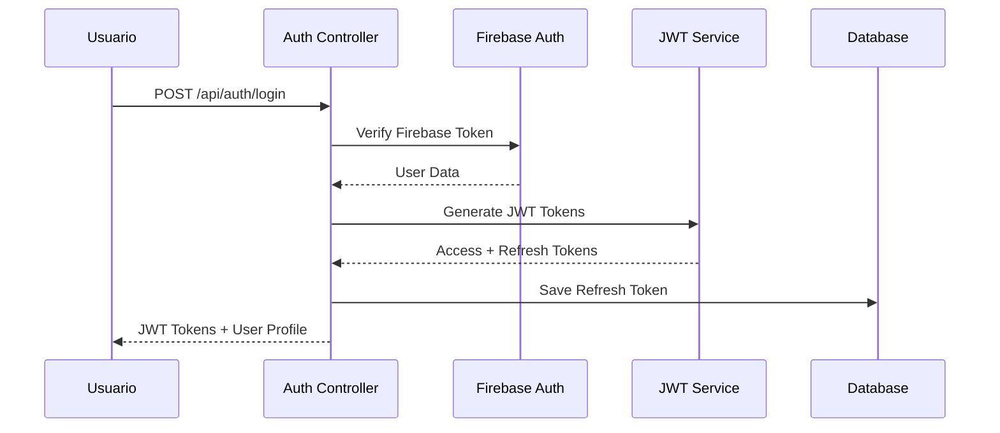
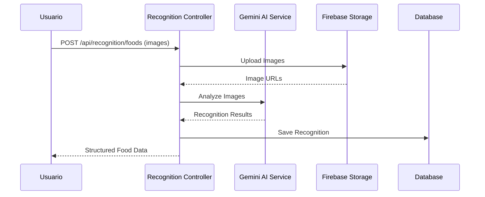
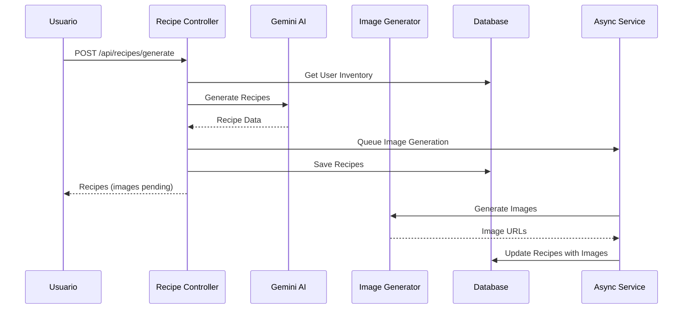

# ZeroWasteAI API - Documentación Completa 🌱

## Tabla de Contenidos
1. [Arquitectura General](#arquitectura-general)
2. [Flujos Principales](#flujos-principales)
3. [Módulos y Casos de Uso](#módulos-y-casos-de-uso)
4. [Controladores y Endpoints](#controladores-y-endpoints)
5. [Modelos de Dominio](#modelos-de-dominio)
6. [Infraestructura](#infraestructura)
7. [Flujos Detallados](#flujos-detallados)

## Arquitectura General

### Patrón Arquitectónico: Clean Architecture

```
┌─────────────────────────────────────┐
│              Interface              │ ← Controllers, Serializers, Middlewares
├─────────────────────────────────────┤
│            Application              │ ← Use Cases, Factories, Services
├─────────────────────────────────────┤
│              Domain                 │ ← Models, Repositories, Value Objects
├─────────────────────────────────────┤
│           Infrastructure            │ ← DB, Firebase, AI Services, Auth
└─────────────────────────────────────┘
```

### Tecnologías Principales:
- **Framework**: Flask + Flask-JWT-Extended
- **Base de Datos**: MySQL + SQLAlchemy ORM
- **Autenticación**: Firebase Auth + JWT
- **Almacenamiento**: Firebase Storage
- **IA**: Google Gemini API
- **Cache/Optimización**: Redis + Rate Limiting

---

## Flujos Principales

### 1. Flujo de Autenticación


### 2. Flujo de Reconocimiento de Alimentos


### 3. Flujo de Generación de Recetas


---

## Módulos y Casos de Uso

### 🔐 Módulo de Autenticación
**Ubicación**: `src/application/use_cases/auth/`

#### Casos de Uso:
1. **LoginOAuthUseCase** - Autenticación con OAuth providers
2. **LoginUserUseCase** - Login tradicional con email/password
3. **LogoutUseCase** - Cerrar sesión y blacklist de tokens
4. **RefreshTokenUseCase** - Renovar tokens de acceso

#### Archivos Involucrados:
- **Controllers**: `auth_controller.py`
- **Services**: `oauth_service.py`, `jwt_service.py`
- **Repositories**: `auth_repository.py`, `token_security_repository.py`
- **Models**: `auth_user.py`, `user.py`

### 🔍 Módulo de Reconocimiento
**Ubicación**: `src/application/use_cases/recognition/`

#### Casos de Uso:
1. **RecognizeFoodsUseCase** - Reconoce alimentos en imágenes
2. **RecognizeIngredientsCompleteUseCase** - Reconocimiento completo de ingredientes
3. **RecognizeBatchUseCase** - Procesamiento en lote

#### Archivos Involucrados:
- **Controllers**: `recognition_controller.py`
- **Services**: `ia_food_analyzer_service.py`, `gemini_adapter_service.py`
- **Models**: `recognition.py`
- **Infrastructure**: `firebase_storage_adapter.py`

### 📦 Módulo de Inventario
**Ubicación**: `src/application/use_cases/inventory/`

#### Casos de Uso:
1. **AddItemToInventoryUseCase** - Agregar elementos al inventario
2. **GetInventoryContentUseCase** - Obtener contenido del inventario
3. **UpdateIngredientQuantityUseCase** - Actualizar cantidades
4. **MarkIngredientStackConsumedUseCase** - Marcar como consumido
5. **GetExpiringSoonUseCase** - Elementos próximos a vencer
6. **DeleteIngredientCompleteUseCase** - Eliminar ingredientes
7. **UploadInventoryImageUseCase** - Subir imágenes del inventario

#### Archivos Involucrados:
- **Controllers**: `inventory_controller.py`
- **Models**: `inventory.py`, `ingredient.py`, `food_item.py`
- **Services**: `inventory_calculator.py`
- **Repositories**: `inventory_repository_impl.py`

### 🍳 Módulo de Recetas
**Ubicación**: `src/application/use_cases/recipes/`

#### Casos de Uso:
1. **GenerateRecipesUseCase** - Generar recetas basadas en inventario
2. **GenerateCustomRecipeUseCase** - Generar recetas personalizadas
3. **SaveRecipeUseCase** - Guardar recetas del usuario
4. **GetSavedRecipesUseCase** - Obtener recetas guardadas
5. **AddRecipeToFavoritesUseCase** - Agregar a favoritos
6. **GetFavoriteRecipesUseCase** - Obtener recetas favoritas
7. **RemoveRecipeFromFavoritesUseCase** - Quitar de favoritos
8. **CalculateEnvironmentalSavingsUseCase** - Calcular impacto ambiental

#### Archivos Involucrados:
- **Controllers**: `recipe_controller.py`
- **Services**: `gemini_recipe_generator_service.py`, `recipe_image_generator_service.py`
- **Models**: `recipe.py`
- **Repositories**: `recipe_repository_impl.py`

### 📅 Módulo de Planificación
**Ubicación**: `src/application/use_cases/planning/`

#### Casos de Uso:
1. **SaveMealPlanUseCase** - Guardar plan de comidas
2. **GetMealPlanByUserAndDateUseCase** - Obtener plan por fecha
3. **GetAllMealPlansByUserUseCase** - Obtener todos los planes
4. **UpdateMealPlanUseCase** - Actualizar plan existente
5. **DeleteMealPlanUseCase** - Eliminar plan
6. **GetMealPlanDatesUseCase** - Obtener fechas con planes

#### Archivos Involucrados:
- **Controllers**: `planning_controller.py`
- **Models**: `daily_meal_plan.py`
- **Repositories**: `meal_plan_repository_impl.py`

### 🖼️ Módulo de Gestión de Imágenes
**Ubicación**: `src/application/use_cases/image_management/`

#### Casos de Uso:
1. **AssignImageReferenceUseCase** - Asignar imagen a ingrediente
2. **SearchSimilarImagesUseCase** - Buscar imágenes similares
3. **UploadImageUseCase** - Subir nueva imagen
4. **SyncImageLoaderUseCase** - Sincronizar imágenes

#### Archivos Involucrados:
- **Controllers**: `image_management_controller.py`
- **Services**: `image_loader_service.py`
- **Models**: `image_reference.py`
- **Repositories**: `image_repository_impl.py`

### 🌱 Módulo de Ahorro Ambiental
**Ubicación**: `src/application/use_cases/recipes/` (cálculos ambientales)

#### Casos de Uso:
1. **EstimateSavingsByTitleUseCase** - Calcular ahorro por título de receta
2. **EstimateSavingsByUidUseCase** - Calcular ahorro por UID de receta
3. **GetAllEnvironmentalCalculationsUseCase** - Obtener todos los cálculos
4. **SumEnvironmentalCalculationsByUserUseCase** - Resumen de impacto

#### Archivos Involucrados:
- **Controllers**: `environmental_savings_controller.py`
- **Models**: `environmental_savings.py`
- **Repositories**: `environmental_savings_repository_impl.py`

---

## Controladores y Endpoints

### 🔐 Auth Controller (`/api/auth`)
| Método | Endpoint | Descripción | Use Case |
|--------|----------|-------------|----------|
| POST | `/login` | Login con Firebase/OAuth | LoginOAuthUseCase |
| POST | `/refresh` | Renovar token de acceso | RefreshTokenUseCase |
| POST | `/logout` | Cerrar sesión | LogoutUseCase |

### 👤 User Controller (`/api/user`)
| Método | Endpoint | Descripción | Archivos |
|--------|----------|-------------|----------|
| GET | `/profile` | Obtener perfil de usuario | Firestore + MySQL sync |
| PUT | `/profile` | Actualizar perfil | ProfileUser schema |

### 🔍 Recognition Controller (`/api/recognition`)
| Método | Endpoint | Descripción | Use Case |
|--------|----------|-------------|----------|
| POST | `/foods` | Reconocer alimentos | RecognizeFoodsUseCase |
| POST | `/ingredients/complete` | Reconocimiento completo | RecognizeIngredientsCompleteUseCase |
| POST | `/batch` | Procesamiento en lote | RecognizeBatchUseCase |

### 📦 Inventory Controller (`/api/inventory`)
| Método | Endpoint | Descripción | Use Case |
|--------|----------|-------------|----------|
| GET | `/content` | Contenido del inventario | GetInventoryContentUseCase |
| POST | `/add_item` | Agregar elemento | AddItemToInventoryUseCase |
| GET | `/ingredients` | Lista de ingredientes | GetIngredientsListUseCase |
| GET | `/foods` | Lista de alimentos | GetFoodsListUseCase |
| GET | `/expiring_soon` | Elementos por vencer | GetExpiringSoonUseCase |
| PUT | `/ingredient/{id}` | Actualizar ingrediente | UpdateIngredientQuantityUseCase |
| DELETE | `/ingredient/{id}` | Eliminar ingrediente | DeleteIngredientCompleteUseCase |
| POST | `/mark_consumed` | Marcar como consumido | MarkIngredientStackConsumedUseCase |

### 🍳 Recipe Controller (`/api/recipes`)
| Método | Endpoint | Descripción | Use Case |
|--------|----------|-------------|----------|
| POST | `/generate` | Generar recetas | GenerateRecipesUseCase |
| POST | `/generate_custom` | Receta personalizada | GenerateCustomRecipeUseCase |
| POST | `/save` | Guardar receta | SaveRecipeUseCase |
| GET | `/saved` | Recetas guardadas | GetSavedRecipesUseCase |
| GET | `/all` | Todas las recetas | GetAllRecipesUseCase |
| POST | `/favorites/add` | Agregar a favoritos | AddRecipeToFavoritesUseCase |
| GET | `/favorites` | Recetas favoritas | GetFavoriteRecipesUseCase |
| DELETE | `/favorites/{id}` | Quitar de favoritos | RemoveRecipeFromFavoritesUseCase |

### 📅 Planning Controller (`/api/planning`)
| Método | Endpoint | Descripción | Use Case |
|--------|----------|-------------|----------|
| POST | `/meal_plan` | Guardar plan de comida | SaveMealPlanUseCase |
| GET | `/meal_plan/{date}` | Plan por fecha | GetMealPlanByUserAndDateUseCase |
| GET | `/meal_plans` | Todos los planes | GetAllMealPlansByUserUseCase |
| PUT | `/meal_plan/{id}` | Actualizar plan | UpdateMealPlanUseCase |
| DELETE | `/meal_plan/{id}` | Eliminar plan | DeleteMealPlanUseCase |
| GET | `/dates` | Fechas con planes | GetMealPlanDatesUseCase |

### 🖼️ Image Management Controller (`/api/image_management`)
| Método | Endpoint | Descripción | Use Case |
|--------|----------|-------------|----------|
| POST | `/assign_image` | Asignar imagen | AssignImageReferenceUseCase |
| POST | `/search_similar_images` | Buscar similares | SearchSimilarImagesUseCase |
| POST | `/upload_image` | Subir imagen | UploadImageUseCase |
| POST | `/sync_images` | Sincronizar BD | SyncImageLoaderUseCase |

### 🌱 Environmental Savings Controller (`/api/environmental_savings`)
| Método | Endpoint | Descripción | Use Case |
|--------|----------|-------------|----------|
| POST | `/calculate/from-title` | Calcular por título | EstimateSavingsByTitleUseCase |
| POST | `/calculate/from-uid/{uid}` | Calcular por UID | EstimateSavingsByUidUseCase |
| GET | `/calculations` | Todos los cálculos | GetAllEnvironmentalCalculationsUseCase |
| GET | `/calculations/status` | Por estado | GetEnvironmentalCalculationsByStatusUseCase |
| GET | `/summary` | Resumen consolidado | SumEnvironmentalCalculationsByUserUseCase |

### 🎨 Generation Controller (`/api/generation`)
| Método | Endpoint | Descripción | Propósito |
|--------|----------|-------------|----------|
| GET | `/images/status/{task_id}` | Estado de generación | Verificar progreso de imágenes |
| GET | `/{generation_id}/images` | Obtener con imágenes | Recetas con imágenes generadas |

### 🛡️ Admin Controller (`/api/admin`)
| Método | Endpoint | Descripción | Uso |
|--------|----------|-------------|-----|
| POST | `/cleanup-tokens` | Limpiar tokens | Mantenimiento interno |
| GET | `/security-stats` | Estadísticas de seguridad | Monitoreo interno |

---

## Modelos de Dominio

### Core Models:
1. **User** - Usuario base del sistema
2. **AuthUser** - Datos de autenticación
3. **ProfileUser** - Perfil y preferencias
4. **Recipe** - Recetas con ingredientes y pasos
5. **Inventory** - Inventario del usuario
6. **Ingredient** - Ingredientes individuales
7. **FoodItem** - Elementos de comida
8. **Recognition** - Resultados de reconocimiento
9. **DailyMealPlan** - Planes de comida diarios
10. **ImageReference** - Referencias de imágenes
11. **EnvironmentalSavings** - Cálculos ambientales

---

## Infraestructura

### Base de Datos (MySQL)
**Ubicación**: `src/infrastructure/db/`
- **Conexión**: SQLAlchemy con pool de conexiones optimizado
- **ORM Models**: Mapeo objeto-relacional
- **Repositories**: Implementaciones de acceso a datos
- **Schemas**: Definiciones de tablas

### Servicios Externos
1. **Firebase Authentication** - Autenticación de usuarios
2. **Firebase Storage** - Almacenamiento de imágenes
3. **Google Gemini AI** - Procesamiento de IA
4. **MySQL Database** - Persistencia de datos

### Optimización y Seguridad
1. **Rate Limiting** - Control de tráfico por endpoint
2. **Cache Service** - Cache de operaciones costosas
3. **Security Headers** - Headers de seguridad HTTP
4. **Token Blacklisting** - Invalidación de tokens

---

## Flujos Detallados

### 🔐 Flujo de Autenticación Completo

#### Archivos Involucrados:
```
Controllers: auth_controller.py
Use Cases: login_oauth_usecase.py, refresh_token_usecase.py, logout_usecase.py
Services: oauth_service.py, jwt_service.py
Models: auth_user.py, user.py, profile_user.py
Infrastructure: firebase_auth, token_security_repository.py
```

#### Proceso:
1. **Usuario envía token de Firebase** → `auth_controller.py`
2. **Validación con Firebase** → `oauth_service.py`
3. **Generación de JWT** → `jwt_service.py`
4. **Guardar refresh token** → `token_security_repository.py`
5. **Respuesta con tokens** → Usuario

### 🔍 Flujo de Reconocimiento de Alimentos

#### Archivos Involucrados:
```
Controllers: recognition_controller.py
Use Cases: recognize_foods_use_case.py, recognize_ingredients_complete_use_case.py
Services: ia_food_analyzer_service.py, gemini_adapter_service.py
Models: recognition.py
Infrastructure: firebase_storage_adapter.py, gemini_recipe_generator_service.py
Repositories: recognition_repository_impl.py
```

#### Proceso:
1. **Upload de imágenes** → `firebase_storage_adapter.py`
2. **Análisis con IA** → `gemini_adapter_service.py`
3. **Procesamiento de resultados** → `ia_food_analyzer_service.py`
4. **Guardado en BD** → `recognition_repository_impl.py`
5. **Respuesta estructurada** → Usuario

### 📦 Flujo de Gestión de Inventario

#### Archivos Involucrados:
```
Controllers: inventory_controller.py
Use Cases: add_item_to_inventory_use_case.py, get_inventory_content_use_case.py, etc.
Services: inventory_calculator.py
Models: inventory.py, ingredient.py, food_item.py
Repositories: inventory_repository_impl.py
```

#### Proceso:
1. **Solicitud de inventario** → `inventory_controller.py`
2. **Lógica de negocio** → Use Cases específicos
3. **Cálculos** → `inventory_calculator.py`
4. **Acceso a datos** → `inventory_repository_impl.py`
5. **Respuesta serializada** → Usuario

### 🍳 Flujo de Generación de Recetas

#### Archivos Involucrados:
```
Controllers: recipe_controller.py
Use Cases: generate_recipes_use_case.py, generate_custom_recipe_use_case.py
Services: gemini_recipe_generator_service.py, recipe_image_generator_service.py
Models: recipe.py
Repositories: recipe_repository_impl.py, inventory_repository_impl.py
Infrastructure: async_task_service.py, gemini_adapter_service.py
```

#### Proceso:
1. **Solicitud de generación** → `recipe_controller.py`
2. **Obtener inventario** → `inventory_repository_impl.py`
3. **Generar recetas con IA** → `gemini_recipe_generator_service.py`
4. **Guardar recetas** → `recipe_repository_impl.py`
5. **Generar imágenes (async)** → `async_task_service.py` + `recipe_image_generator_service.py`
6. **Respuesta con recetas** → Usuario

### 🌱 Flujo de Cálculo de Impacto Ambiental

#### Archivos Involucrados:
```
Controllers: environmental_savings_controller.py
Use Cases: calculate_environmental_savings_from_recipe_*.py
Services: Integrado en recipe services
Models: environmental_savings.py
Repositories: environmental_savings_repository_impl.py
```

#### Proceso:
1. **Solicitud de cálculo** → `environmental_savings_controller.py`
2. **Obtener datos de receta** → `recipe_repository_impl.py`
3. **Cálculos de impacto** → Use Cases específicos
4. **Guardar resultados** → `environmental_savings_repository_impl.py`
5. **Respuesta con métricas** → Usuario

---

## Patrones de Diseño Utilizados

1. **Clean Architecture** - Separación de responsabilidades
2. **Repository Pattern** - Abstracción de acceso a datos
3. **Factory Pattern** - Creación de instancias de Use Cases
4. **Observer Pattern** - Eventos asincrónicos
5. **Strategy Pattern** - Diferentes algoritmos de IA
6. **Decorator Pattern** - Middleware y validaciones

---

## Consideraciones de Performance

1. **Database Connection Pooling** - Pool optimizado de conexiones
2. **Caching Strategy** - Cache de operaciones costosas de IA
3. **Rate Limiting** - Prevención de abuso de recursos
4. **Async Processing** - Generación de imágenes en background
5. **Compression** - Compresión HTTP para responses grandes
6. **Lazy Loading** - Carga bajo demanda de relaciones

---

## Seguridad

1. **Firebase Authentication** - Autenticación robusta
2. **JWT with Blacklisting** - Tokens seguros con invalidación
3. **Security Headers** - Headers HTTP de seguridad
4. **Rate Limiting** - Protección contra ataques DoS
5. **Input Validation** - Validación exhaustiva de entradas
6. **SQL Injection Prevention** - ORM con prepared statements

---

## Monitoreo y Logging

1. **Security Logger** - Log de eventos de seguridad
2. **Performance Monitor** - Monitoreo de rendimiento de IA
3. **Error Tracking** - Manejo centralizado de errores
4. **Usage Analytics** - Métricas de uso de endpoints

---

*Documentación generada para ZeroWasteAI API v1.0.0*
*Arquitectura: Clean Architecture con Firebase + JWT*
*Desarrollado con ❤️ para un futuro más sustentable 🌍*