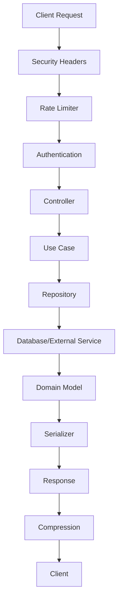
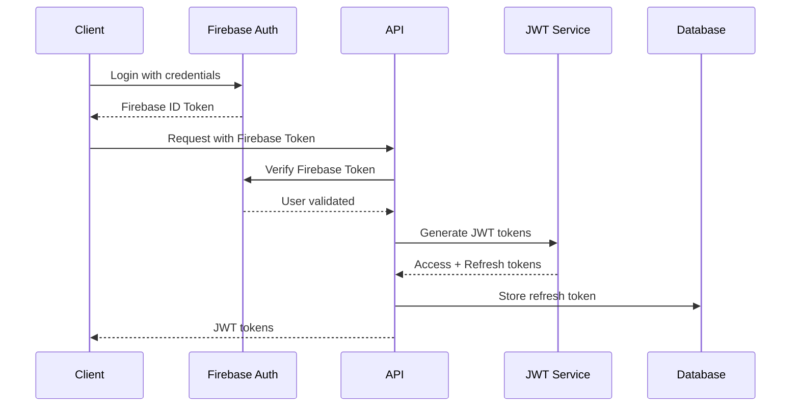

# ZeroWasteAI API - Arquitectura y Patrones 🏗️

## Índice
1. [Visión General de la Arquitectura](#visión-general-de-la-arquitectura)
2. [Patrones de Diseño](#patrones-de-diseño)
3. [Estructura de Directorios](#estructura-de-directorios)
4. [Capas de la Aplicación](#capas-de-la-aplicación)
5. [Tecnologías y Servicios](#tecnologías-y-servicios)
6. [Flujo de Datos](#flujo-de-datos)
7. [Seguridad y Autenticación](#seguridad-y-autenticación)
8. [Performance y Escalabilidad](#performance-y-escalabilidad)

---

## Visión General de la Arquitectura

### Clean Architecture Implementation

```
┌─────────────────────────────────────────────────────────────┐
│                        INTERFACE LAYER                      │
│  📱 Controllers | 📄 Serializers | 🛡️ Middlewares           │
│                                                             │
│  ├── auth_controller.py           ├── rate_limiter.py      │
│  ├── recipe_controller.py         ├── security_headers.py  │
│  ├── inventory_controller.py      └── cache_middleware.py  │
│  └── ...                                                   │
├─────────────────────────────────────────────────────────────┤
│                      APPLICATION LAYER                      │
│  🔧 Use Cases | 🏭 Factories | 🎯 Services                  │
│                                                             │
│  ├── use_cases/                   ├── factories/           │
│  │   ├── auth/                    │   ├── auth_factory.py  │
│  │   ├── recipes/                 │   └── recipe_factory.py│
│  │   ├── inventory/               └── services/            │
│  │   └── recognition/                 ├── ai_service.py    │
│  └── ...                              └── cache_service.py │
├─────────────────────────────────────────────────────────────┤
│                       DOMAIN LAYER                          │
│  🏛️ Models | 📋 Repositories | 💎 Value Objects            │
│                                                             │
│  ├── models/                      ├── repositories/        │
│  │   ├── user.py                  │   ├── user_repository  │
│  │   ├── recipe.py                │   ├── recipe_repository│
│  │   ├── inventory.py             │   └── ...              │
│  │   └── ...                      └── value_objects/       │
│  └── ...                              └── upload_request.py│
├─────────────────────────────────────────────────────────────┤
│                    INFRASTRUCTURE LAYER                     │
│  🗄️ Database | 🔥 Firebase | 🤖 AI | 🔐 Security           │
│                                                             │
│  ├── db/                          ├── ai/                  │
│  │   ├── schemas/                 │   ├── gemini_service.py│
│  │   ├── models/                  │   └── image_gen.py     │
│  │   └── repositories/            ├── auth/                │
│  ├── storage/                     │   ├── firebase_auth.py │
│  │   └── firebase_adapter.py      │   └── jwt_service.py   │
│  └── ...                          └── ...                  │
└─────────────────────────────────────────────────────────────┘
```

### Principios de Clean Architecture Aplicados:

1. **Dependency Inversion** - Las dependencias apuntan hacia adentro
2. **Interface Segregation** - Interfaces específicas por responsabilidad
3. **Single Responsibility** - Cada clase tiene una única razón para cambiar
4. **Open/Closed** - Abierto para extensión, cerrado para modificación

---

## Patrones de Diseño

### 1. 🏭 Factory Pattern
**Ubicación**: `src/application/factories/`

```python
# Ejemplo: recipe_usecase_factory.py
def make_generate_recipes_use_case():
    return GenerateRecipesUseCase(
        inventory_repository=InventoryRepositoryImpl(db),
        recipe_repository=RecipeRepositoryImpl(db),
        ai_service=GeminiRecipeGeneratorService(),
        profile_service=make_firestore_profile_service()
    )
```

**Beneficios**:
- Centraliza la creación de objetos complejos
- Facilita testing con mocks
- Desacopla la construcción del uso

### 2. 📚 Repository Pattern
**Ubicación**: `src/infrastructure/db/`

```python
# Interfaz en Domain
class RecipeRepository(ABC):
    @abstractmethod
    def save(self, recipe: Recipe) -> Recipe:
        pass
    
    @abstractmethod
    def find_by_uid(self, uid: str) -> Optional[Recipe]:
        pass

# Implementación en Infrastructure
class RecipeRepositoryImpl(RecipeRepository):
    def save(self, recipe: Recipe) -> Recipe:
        # Implementación con SQLAlchemy
        pass
```

**Beneficios**:
- Abstrae el acceso a datos
- Facilita cambio de tecnología de persistencia
- Permite testing sin base de datos

### 3. 🎯 Strategy Pattern
**Ubicación**: `src/infrastructure/ai/`

```python
# Diferentes estrategias de IA
class AIService(ABC):
    @abstractmethod
    def analyze_image(self, image: bytes) -> dict:
        pass

class GeminiAIService(AIService):
    def analyze_image(self, image: bytes) -> dict:
        # Implementación con Gemini
        pass

class OpenAIService(AIService):
    def analyze_image(self, image: bytes) -> dict:
        # Implementación alternativa
        pass
```

### 4. 🎭 Decorator Pattern
**Ubicación**: `src/infrastructure/optimization/`

```python
# Rate limiting decorator
@smart_rate_limit('ai_generation')
def generate_recipe():
    # Endpoint protegido
    pass

# Cache decorator
@smart_cache('recipe_data', timeout=3600)
def get_recipes():
    # Endpoint cacheado
    pass
```

### 5. 👁️ Observer Pattern
**Ubicación**: `src/infrastructure/async_tasks/`

```python
# Para procesamiento asíncrono
class AsyncTaskService:
    def __init__(self):
        self.observers = []
    
    def notify_completion(self, task_id: str, result: dict):
        for observer in self.observers:
            observer.on_task_completed(task_id, result)
```

---

## Estructura de Directorios

### 📁 Organización del Código

```
src/
├── 🌐 interface/                    # Capa de Interfaz
│   ├── controllers/                 # Controladores REST
│   │   ├── auth_controller.py
│   │   ├── recipe_controller.py
│   │   ├── inventory_controller.py
│   │   └── ...
│   ├── serializers/                 # Serializadores JSON
│   │   ├── recipe_serializers.py
│   │   ├── inventory_serializers.py
│   │   └── ...
│   └── middlewares/                 # Middlewares HTTP
│       ├── auth_middleware.py
│       └── cors_middleware.py
│
├── 🎯 application/                  # Capa de Aplicación
│   ├── use_cases/                   # Casos de Uso
│   │   ├── auth/
│   │   │   ├── login_oauth_usecase.py
│   │   │   ├── refresh_token_usecase.py
│   │   │   └── logout_usecase.py
│   │   ├── recipes/
│   │   │   ├── generate_recipes_use_case.py
│   │   │   ├── save_recipe_use_case.py
│   │   │   └── ...
│   │   ├── inventory/
│   │   ├── recognition/
│   │   ├── planning/
│   │   └── image_management/
│   ├── factories/                   # Factories para DI
│   │   ├── auth_usecase_factory.py
│   │   ├── recipe_usecase_factory.py
│   │   └── ...
│   └── services/                    # Servicios de Aplicación
│       ├── inventory_calculator.py
│       └── email_service.py
│
├── 🏛️ domain/                       # Capa de Dominio
│   ├── models/                      # Modelos de Dominio
│   │   ├── user.py
│   │   ├── recipe.py
│   │   ├── inventory.py
│   │   ├── ingredient.py
│   │   └── ...
│   ├── repositories/                # Interfaces de Repositorios
│   │   ├── user_repository.py
│   │   ├── recipe_repository.py
│   │   └── ...
│   └── value_objects/               # Objetos de Valor
│       ├── upload_request.py
│       └── recipe_difficulty.py
│
├── 🔧 infrastructure/               # Capa de Infraestructura
│   ├── db/                          # Base de Datos
│   │   ├── base.py                  # Configuración SQLAlchemy
│   │   ├── schemas/                 # Esquemas ORM
│   │   │   ├── user_schema.py
│   │   │   ├── recipe_orm.py
│   │   │   └── ...
│   │   ├── models/                  # Modelos ORM
│   │   │   ├── recipe_orm.py
│   │   │   ├── inventory_orm.py
│   │   │   └── ...
│   │   └── repositories/            # Implementaciones
│   │       ├── user_repository_impl.py
│   │       ├── recipe_repository_impl.py
│   │       └── ...
│   ├── auth/                        # Autenticación
│   │   ├── firebase_auth.py
│   │   ├── jwt_service.py
│   │   └── oauth_service.py
│   ├── ai/                          # Servicios de IA
│   │   ├── gemini_adapter_service.py
│   │   ├── gemini_recipe_generator_service.py
│   │   └── recipe_image_generator_service.py
│   ├── storage/                     # Almacenamiento
│   │   └── firebase_storage_adapter.py
│   ├── optimization/                # Optimización
│   │   ├── rate_limiter.py
│   │   └── cache_service.py
│   ├── security/                    # Seguridad
│   │   ├── security_headers.py
│   │   ├── security_logger.py
│   │   └── token_security_repository.py
│   └── async_tasks/                 # Tareas Asíncronas
│       └── async_task_service.py
│
├── 🛠️ shared/                       # Código Compartido
│   ├── exceptions/                  # Excepciones Personalizadas
│   │   ├── base.py
│   │   └── custom.py
│   ├── decorators/                  # Decoradores
│   │   └── internal_only.py
│   └── utils/                       # Utilidades
│       └── date_utils.py
│
├── ⚙️ config/                       # Configuración
│   ├── config.py                    # Configuración principal
│   └── swagger_config.py            # Configuración Swagger
│
└── 🚀 main.py                       # Punto de entrada
```

---

## Capas de la Aplicación

### 🌐 Interface Layer (Interfaz)

**Responsabilidades**:
- Manejo de requests/responses HTTP
- Validación de entrada
- Serialización de datos
- Autenticación y autorización

**Componentes Principales**:
- **Controllers**: Manejan endpoints REST
- **Serializers**: Convierten entre JSON y objetos Python
- **Middlewares**: Procesan requests transversalmente

**Ejemplo**:
```python
@recipes_bp.route("/generate", methods=["POST"])
@jwt_required()
@smart_rate_limit('ai_generation')
def generate_recipes():
    user_uid = get_jwt_identity()
    data = request.get_json()
    
    use_case = make_generate_recipes_use_case()
    result = use_case.execute(user_uid=user_uid, **data)
    
    return jsonify(result), 200
```

### 🎯 Application Layer (Aplicación)

**Responsabilidades**:
- Orchestración de casos de uso
- Lógica de aplicación específica
- Coordinación entre servicios
- Manejo de transacciones

**Componentes Principales**:
- **Use Cases**: Implementan casos de uso específicos
- **Factories**: Crean instancias con dependencias
- **Services**: Servicios de aplicación

**Ejemplo**:
```python
class GenerateRecipesUseCase:
    def __init__(self, inventory_repo, recipe_repo, ai_service):
        self.inventory_repo = inventory_repo
        self.recipe_repo = recipe_repo
        self.ai_service = ai_service
    
    def execute(self, user_uid: str, preferences: dict):
        # 1. Obtener inventario del usuario
        inventory = self.inventory_repo.get_user_inventory(user_uid)
        
        # 2. Generar recetas con IA
        recipes = self.ai_service.generate_recipes(inventory, preferences)
        
        # 3. Guardar recetas generadas
        saved_recipes = []
        for recipe in recipes:
            saved_recipe = self.recipe_repo.save(recipe)
            saved_recipes.append(saved_recipe)
        
        return saved_recipes
```

### 🏛️ Domain Layer (Dominio)

**Responsabilidades**:
- Modelos de negocio
- Reglas de dominio
- Interfaces de repositorios
- Objetos de valor

**Componentes Principales**:
- **Models**: Entidades de dominio
- **Repositories**: Interfaces abstractas
- **Value Objects**: Objetos inmutables

**Ejemplo**:
```python
class Recipe:
    def __init__(self, uid: str, title: str, ingredients: List[RecipeIngredient]):
        self.uid = uid
        self.title = title
        self.ingredients = ingredients
        self._validate()
    
    def _validate(self):
        if not self.title or len(self.title) < 3:
            raise ValueError("Recipe title must be at least 3 characters")
        
        if not self.ingredients:
            raise ValueError("Recipe must have at least one ingredient")
    
    def get_total_calories(self) -> float:
        return sum(ingredient.calories for ingredient in self.ingredients)
```

### 🔧 Infrastructure Layer (Infraestructura)

**Responsabilidades**:
- Acceso a datos externos
- Implementación de repositorios
- Servicios de terceros
- Configuración técnica

**Componentes Principales**:
- **Database**: ORM y esquemas de BD
- **External Services**: APIs externas (Firebase, Gemini)
- **Security**: Autenticación y autorización
- **Optimization**: Cache y rate limiting

**Ejemplo**:
```python
class RecipeRepositoryImpl(RecipeRepository):
    def __init__(self, db: SQLAlchemy):
        self.db = db
    
    def save(self, recipe: Recipe) -> Recipe:
        recipe_orm = RecipeORM(
            uid=recipe.uid,
            title=recipe.title,
            user_uid=recipe.user_uid
        )
        
        self.db.session.add(recipe_orm)
        self.db.session.commit()
        
        return self._map_to_domain(recipe_orm)
```

---

## Tecnologías y Servicios

### 🐍 Backend Framework
```python
# Flask con extensiones
Flask==2.3.3
Flask-JWT-Extended==4.5.3
Flask-SQLAlchemy==3.0.5
Flask-CORS==4.0.0
Flask-Compress==1.13
Flasgger==0.9.7.1  # Swagger/OpenAPI
```

### 🗄️ Base de Datos
```yaml
Primary Database: MySQL 8.0
ORM: SQLAlchemy 2.0
Connection Pool: 
  - Size: 20 connections
  - Max Overflow: 40
  - Timeout: 30s
  - Recycle: 3600s
```

### 🔥 Firebase Services
```yaml
Authentication: Firebase Auth
Storage: Firebase Storage
Database: Firestore (profiles)
```

### 🤖 AI Services
```yaml
Primary AI: Google Gemini API
- Text Generation: gemini-pro
- Image Analysis: gemini-pro-vision
- Image Generation: Custom pipeline
```

### 🚀 Optimization
```yaml
Cache: Redis (smart_cache)
Rate Limiting: Flask-Limiter
Compression: gzip/deflate
Async Tasks: Custom queue system
```

### 🛡️ Security
```yaml
Authentication: Firebase Auth + JWT
Token Management: Blacklisting system
Headers: Security headers middleware
Validation: Marshmallow schemas
CORS: Configured for web apps
```

---

## Flujo de Datos

### 📊 Request/Response Flow



### 🔄 Data Transformation Flow

```
Raw Data → ORM Model → Domain Model → Use Case → Controller → JSON Response
    ↑                                                              ↓
Database                                                    Client App
```

### 🎯 Dependency Flow

```
Controllers → Use Cases → Repositories → Infrastructure
     ↓              ↓           ↓              ↓
Interfaces    Domain Models  Abstractions  Implementations
```

---

## Seguridad y Autenticación

### 🔐 Authentication Flow



### 🛡️ Security Layers

1. **Network Level**:
   - HTTPS enforcement
   - CORS configuration
   - Security headers

2. **Application Level**:
   - JWT token validation
   - Token blacklisting
   - Rate limiting

3. **Data Level**:
   - Input validation
   - SQL injection prevention
   - Data encryption

### 🔑 Token Management

```python
# Token lifecycle
1. Login → Generate access (30min) + refresh (30 days) tokens
2. API calls → Validate access token
3. Token refresh → Generate new access token, mark old refresh as used
4. Logout → Blacklist current tokens
5. Cleanup → Remove expired tokens (automated)
```

---

## Performance y Escalabilidad

### 📈 Performance Optimizations

1. **Database Level**:
   ```python
   # Connection pooling
   SQLALCHEMY_ENGINE_OPTIONS = {
       'pool_size': 20,
       'max_overflow': 40,
       'pool_timeout': 30,
       'pool_recycle': 3600,
       'pool_pre_ping': True
   }
   ```

2. **Application Level**:
   ```python
   # Intelligent caching
   @smart_cache('recipe_generation', timeout=3600)
   def generate_recipes():
       # Expensive AI operation cached
       pass
   
   # Rate limiting
   @smart_rate_limit('ai_generation', '10/minute')
   def ai_endpoint():
       # Protected expensive endpoint
       pass
   ```

3. **Response Level**:
   ```python
   # HTTP compression
   COMPRESS_LEVEL = 6
   COMPRESS_ALGORITHM = 'gzip'
   COMPRESS_MIMETYPES = ['application/json', 'text/plain']
   ```

### 🔀 Async Processing

```python
# Background image generation
@recipes_bp.route("/generate", methods=["POST"])
def generate_recipes():
    # 1. Generate recipes synchronously
    recipes = use_case.execute()
    
    # 2. Queue image generation asynchronously
    async_task_service.queue_image_generation(recipes)
    
    # 3. Return immediately (images will be ready later)
    return jsonify(recipes), 200
```

### 📊 Monitoring Metrics

1. **Response Times**: Por endpoint y operación
2. **AI Usage**: Tokens consumidos y costos
3. **Cache Performance**: Hit rate y misses
4. **Database Load**: Conexiones activas y queries lentas
5. **Error Rates**: Por tipo y endpoint

### 🎯 Scalability Patterns

1. **Horizontal Scaling**:
   - Stateless design
   - Database connection pooling
   - Externalized session storage

2. **Vertical Optimization**:
   - Efficient queries
   - Caching strategies
   - Async processing

3. **Resource Management**:
   - Rate limiting
   - Request timeout configuration
   - Memory usage optimization

---

## Consideraciones de Deployment

### 🚀 Production Readiness

1. **Environment Configuration**:
   ```python
   # Production settings
   DEBUG = False
   SQLALCHEMY_ECHO = False
   JWT_ACCESS_TOKEN_EXPIRES = timedelta(minutes=30)
   MAX_CONTENT_LENGTH = 10 * 1024 * 1024  # 10MB
   ```

2. **Health Checks**:
   - `/status` endpoint
   - Database connectivity
   - External services status

3. **Logging and Monitoring**:
   - Security event logging
   - Performance metrics
   - Error tracking

### 📦 Container Configuration

```dockerfile
# Multi-stage build
FROM python:3.11-slim as builder
COPY requirements.txt .
RUN pip install --no-cache-dir -r requirements.txt

FROM python:3.11-slim
COPY --from=builder /usr/local/lib/python3.11/site-packages /usr/local/lib/python3.11/site-packages
COPY src/ /app/src/
WORKDIR /app
CMD ["python", "-m", "src.main"]
```

---

*Arquitectura ZeroWasteAI API v1.0.0*
*Clean Architecture + Firebase + JWT + AI Integration*
*Diseñado para escalabilidad, mantenibilidad y rendimiento* 🌱